# 03 — Diagramas de Flujo

Área de Liquidaciones · Versión 1.0 — 2026-08-31

Los diagramas complementan las [narrativas](./02-narrativas-procesos.md). Cada punto de control
aparece rotulado con su código `C-xx` de la [matriz de control](./04-matriz-de-control.md).

---

## 1. Mapa de procesos del área

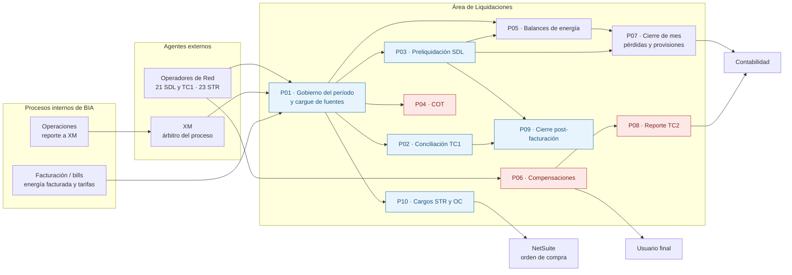

> **Rojo = proceso sin soporte del sistema.** COT, compensaciones y TC2 se ejecutan íntegramente
> en Excel y correo. Dos de los tres terminan en dinero que sale hacia el usuario final.

---

## 2. Calendario del ciclo mensual

Trabajo del mes calendario **M+1** sobre el consumo del mes **M**.

```mermaid
gantt
  title Ciclo mensual del área — mes M+1 sobre consumos de M
  dateFormat DD
  axisFormat día %d

  section Entradas
  Llegan TC1 de los 21 OR            :a1, 01, 5d
  Descarga Facturación y XM          :milestone, a2, 08, 0d
  Llegan preliquidaciones SDL        :a3, 08, 8d
  Llegan balances de energía         :a4, 24, 6d
  Llega COT                          :a5, 25, 10d

  section Conciliaciones
  Conciliación y respuesta TC1       :b1, 03, 9d
  Conciliación SDL, respuesta en 1 día :crit, b2, 08, 8d
  Validación de balances             :b3, 25, 6d
  Validación COT                     :b4, 26, 9d

  section Reportes
  Cierre de mes a Contabilidad       :milestone, crit, c1, 07, 0d
  Reporte TC2 a Contabilidad         :milestone, crit, c2, 15, 0d
  Cierre post-facturación            :c3, 16, 5d
```

**Los tres cuellos de botella del calendario**

| Fecha | Compromiso | Por qué aprieta |
|---|---|---|
| **Día 7** | Cierre a Contabilidad | Se reporta **antes** de tener la preliquidación SDL del mes (llega desde el día 8): el reporte se arma con la conciliación del período anterior |
| **Día 8-15** | Respuesta al OR en **1 día calendario** | Corre en fines de semana y festivos, y se solapa con TC1 y TC2 |
| **Día 12 / Día 15** | TC1 respondido / TC2 enviado | Ambos dentro de la ventana de mayor carga del mes |

---

## 3. Flujo de datos: de dónde sale cada cifra

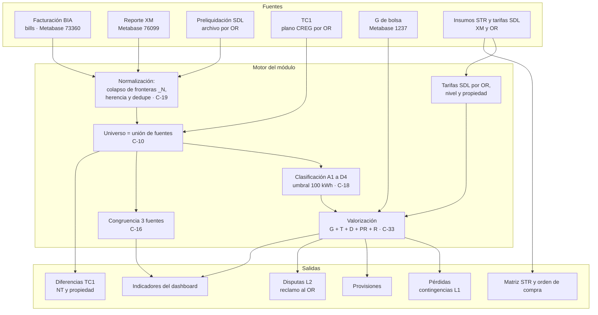

---

## 4. P01 — Cargue de una fuente

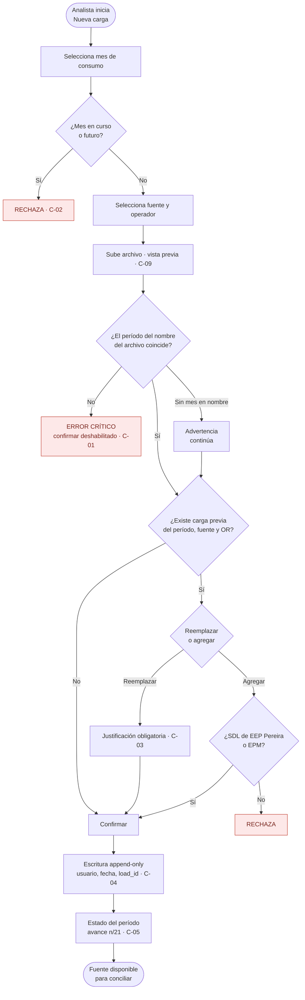

---

## 5. P03 — Conciliación SDL, flujo completo

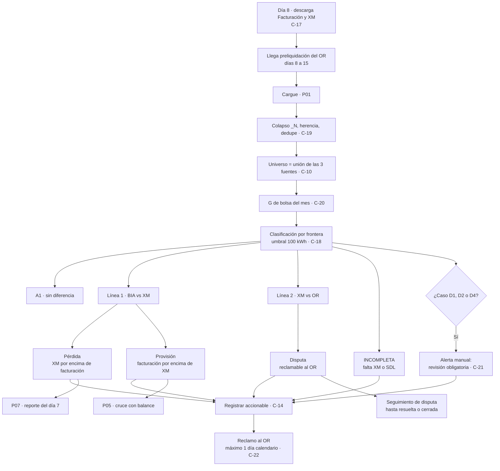

---

## 6. Árbol de decisión de casos SDL

La regla de negocio en una sola imagen: **XM es el árbitro**.

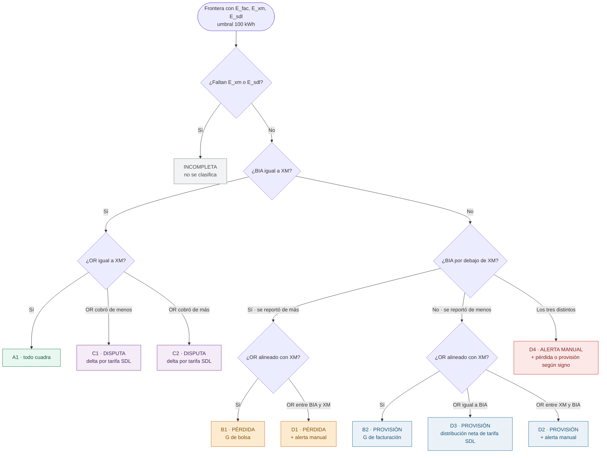

| Resultado | Qué significa para el dinero | Quién lo asume |
|---|---|---|
| **A1** | Nada que hacer | — |
| **Disputa (C1, C2)** | El OR liquidó distinto de XM | **Se reclama al OR** |
| **Pérdida (B1, D1)** | Se reportó a XM más energía de la facturada | **La absorbe BIA** |
| **Provisión (B2, D2, D3)** | Se facturó más de lo reportado; el OR lo cobrará después | **Se provisiona y se libera con el balance** |
| **Alerta manual (D1, D2, D4)** | Las tres fuentes difieren: no hay regla automática | **Decide el analista** |

---

## 7. P05 — Balance de energía y ciclo de la provisión

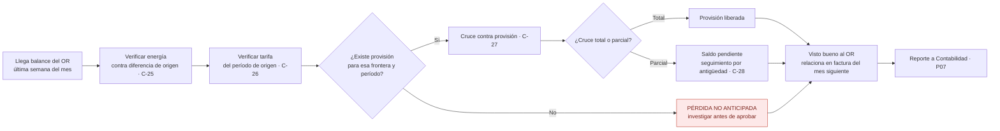

### Ciclo de vida de las posiciones económicas

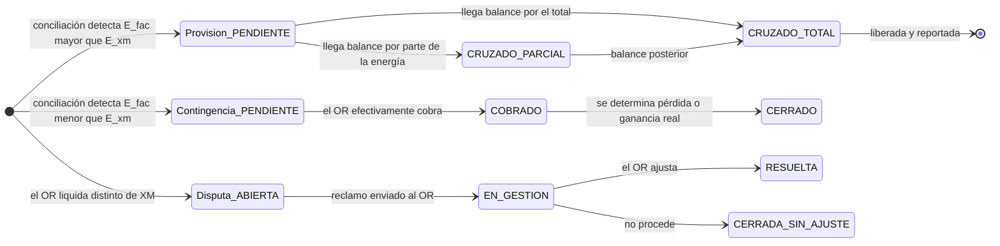

> **Punto de control (F-07):** el paso a `CERRADA_SIN_AJUSTE` extingue un derecho de cobro contra
> el OR. Hoy lo puede ejecutar el mismo analista que hizo la conciliación, sin aprobación ni
> revisión posterior.

---

## 8. P06 — Compensaciones: el flujo del dinero hacia el usuario

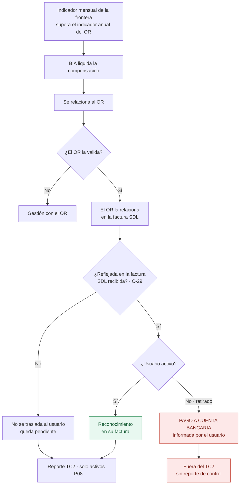

> **Los dos nodos rojos son el punto más expuesto del área.** Un pago en efectivo a un tercero
> que ya no es cliente, calculado por BIA, con datos bancarios recibidos por un canal no
> verificado, ejecutado sin sistema y **excluido del único reporte de control existente (TC2)**.
> Ver [05 — F-04](./05-riesgos-de-fraude.md#f-04--desvío-del-pago-de-compensaciones-a-usuarios-retirados).

---

## 9. P07 — Cierre de mes hacia Contabilidad

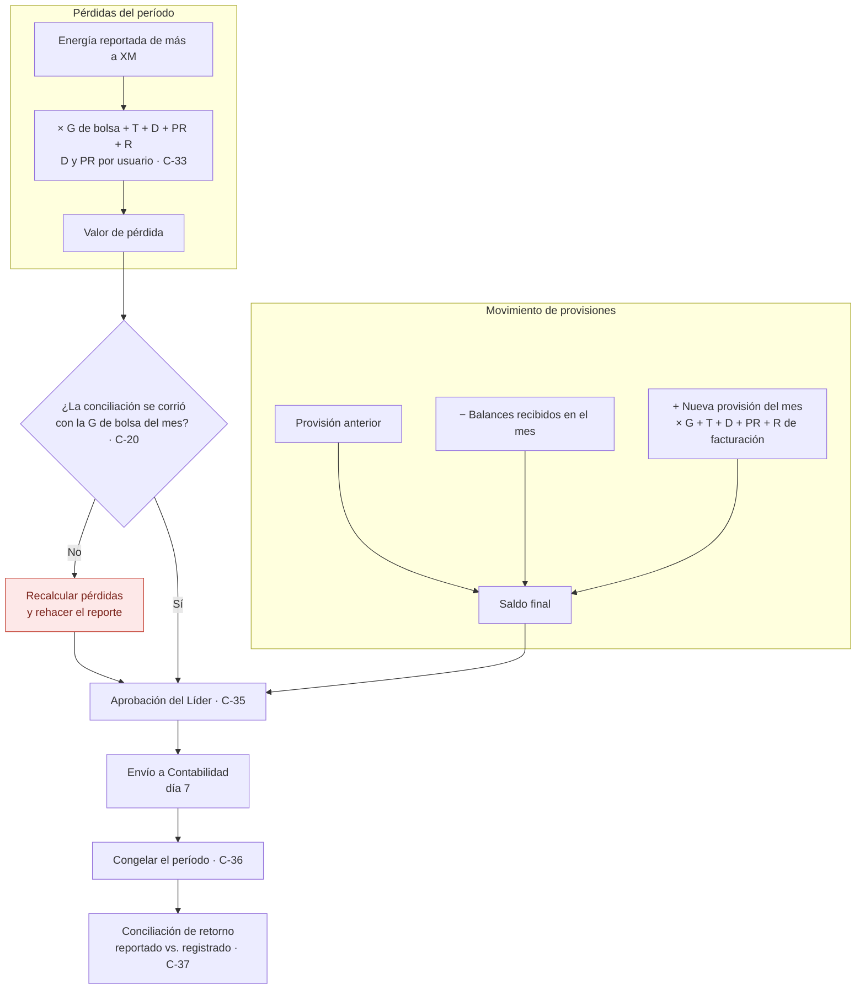

---

## 10. P10 — Cargos STR: del insumo a la orden de compra

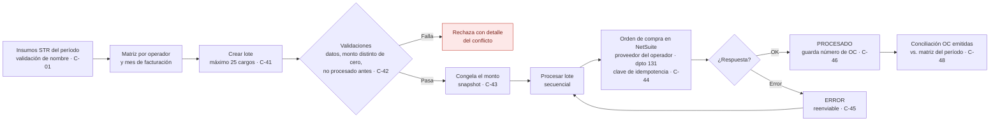

### Estados del envío a NetSuite

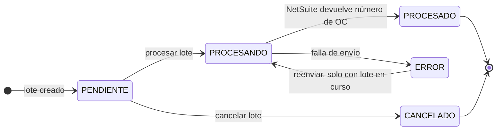

---

## 11. Vista de segregación de funciones (situación actual)

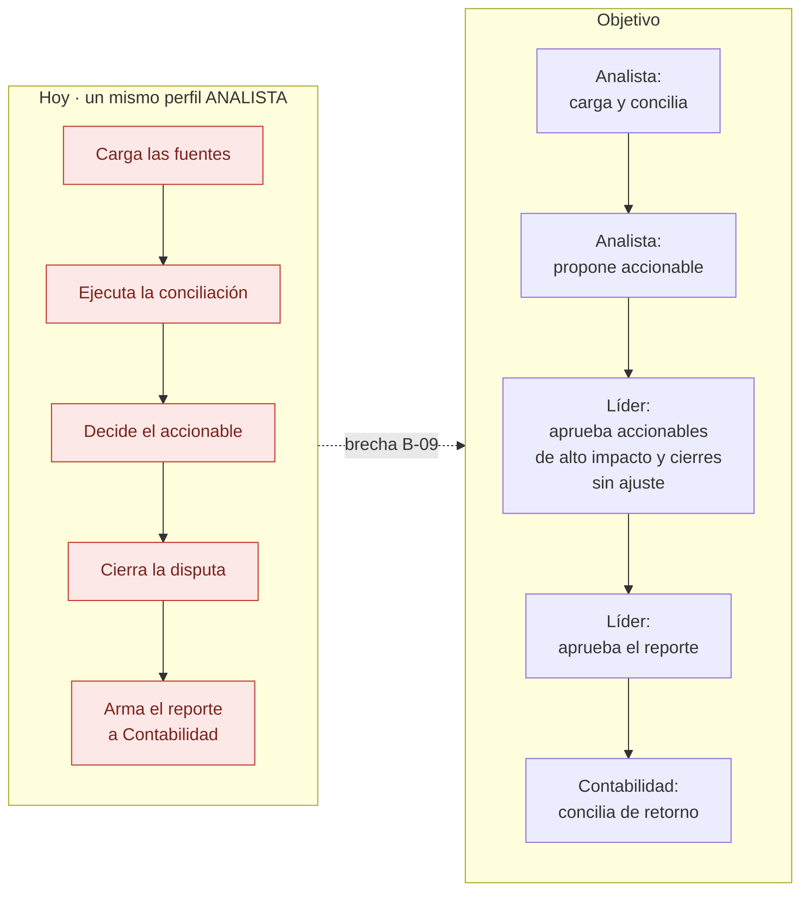

Detalle en [05 — Riesgos de fraude §4](./05-riesgos-de-fraude.md#4-matriz-de-segregación-de-funciones).
