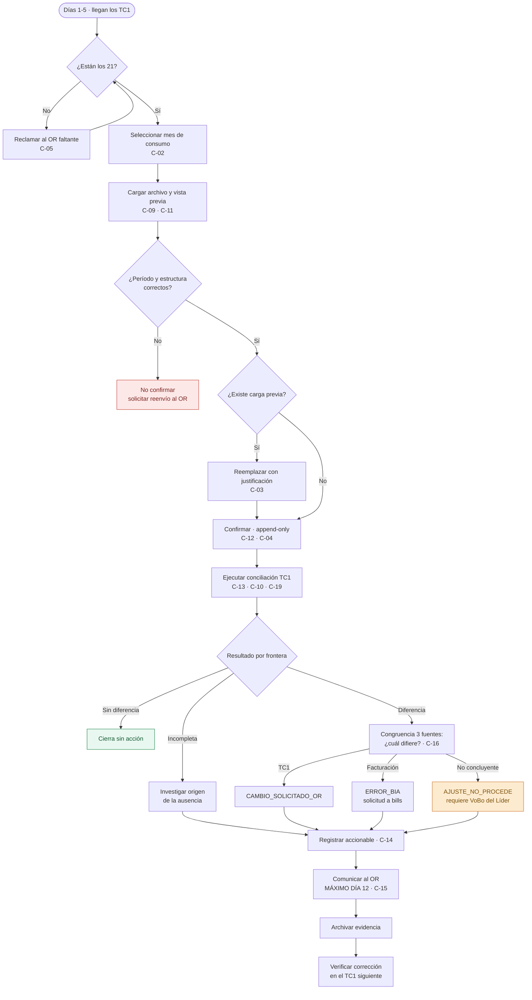

# PR-LIQ-01 · Conciliación del Formato TC1

| | |
|---|---|
| **Código** | PR-LIQ-01 |
| **Versión** | 1.0 |
| **Fecha de emisión** | 2026-08-31 |
| **Macroproceso** | Gestión Financiera › Liquidaciones |
| **Proceso** | Conciliación del Formato TC1 |
| **Elaboró** | Área de Liquidaciones |
| **Revisó** | Líder de Liquidaciones |
| **Aprobó** | Vicepresidencia Financiera |
| **Frecuencia de revisión** | Semestral, o ante cambio de proceso o de sistema |
| **Estado** | Borrador para aprobación |

---

## 1. Objetivo

Verificar que el **nivel de tensión** y la **propiedad de los activos** que cada Operador de Red
(OR) reporta mensualmente en el formato TC1 coincidan con los que BIA Energy utiliza para
facturar al usuario final, y gestionar hasta su cierre toda diferencia detectada.

**Por qué existe este control:** nivel de tensión y propiedad de activos son los dos atributos
que determinan la tarifa de uso de red aplicada al usuario. Un error en cualquiera de ellos
produce un cobro incorrecto **que se repite mes a mes** hasta que alguien lo detecta.

## 2. Alcance

**Incluye:** la recepción, cargue, conciliación, análisis, gestión y respuesta del formato TC1 de
los **21 Operadores de Red** con los que BIA tiene fronteras en el mercado de uso de red, para un
período de consumo determinado.

**No incluye:** la corrección en el sistema de facturación (la ejecuta el área de Facturación a
solicitud de este procedimiento), la conciliación de energía (ver
[PR-LIQ-02](./PR-LIQ-02-preliquidacion-sdl.md)) y el reporte contable
(ver [PR-LIQ-06](./PR-LIQ-06-cierre-de-mes.md)).

## 3. Definiciones

| Término | Definición |
|---|---|
| **TC1** | Formato regulatorio de 33 columnas con que el OR reporta la configuración técnica de cada frontera. Llega en archivo plano. |
| **Frontera comercial** | Punto de medición identificado por su código SIC. Unidad de conciliación de este procedimiento. |
| **Nivel de tensión (NT)** | Clasificación del punto de conexión (1, 2 o 3) que determina el cargo de uso de red. |
| **Propiedad de activos** | Titularidad de los activos de conexión: del OR, del usuario o compartida. Modifica la tarifa aplicable. |
| **Período de consumo** | Mes al que corresponde la información. Es la clave del cargue. |
| **Frontera `_N`** | Frontera con sufijo que solo existe en la facturación de BIA. Debe colapsarse a su frontera base antes de comparar. |
| **Accionable** | Decisión registrada por el analista sobre una frontera con diferencia. |
| **Congruencia** | Cruce simultáneo de Facturación, SDL y TC1 que determina **cuál de las tres fuentes** difiere. |

## 4. Documentos de referencia

- [Manual del Área de Liquidaciones](../01-manual-liquidaciones.md) — políticas P-01 a P-10
- [Matriz de riesgos y controles](../04-matriz-de-control.md)
- [Riesgos de fraude](../05-riesgos-de-fraude.md)
- Criterio de universo de conciliación: `docs/backend/conciliacion-universo-union.md`

## 5. Responsabilidades

| Rol | R | A | C | I | Responsabilidad específica |
|---|:-:|:-:|:-:|:-:|---|
| **Analista de Liquidaciones** | ✔ | | | | Recibe, carga, concilia, analiza, registra accionables y responde al OR |
| **Líder de Liquidaciones** | | ✔ | | | Aprueba los accionables `AJUSTE_NO_PROCEDE`, verifica el cumplimiento del plazo del día 12 |
| **Facturación (bills)** | | | ✔ | | Ejecuta la corrección cuando el error es de BIA |
| **Operador de Red** | | | ✔ | | Emite el formato y corrige lo que se le observa |
| **TI / Producto** | | | | ✔ | Sostiene el parser y el motor de conciliación |

*(R = ejecuta · A = aprueba · C = consultado · I = informado)*

## 6. Entradas y salidas

| Entradas | Origen | Oportunidad |
|---|---|---|
| 21 archivos TC1 | Operadores de Red, por correo | Días 1 a 5 del mes M+1 |
| Facturación del período | bills / Metabase | Día 8, o la disponible al conciliar |

| Salidas | Destino | Oportunidad |
|---|---|---|
| Resultado de conciliación por frontera | Módulo de Liquidaciones | Al conciliar |
| Accionables registrados | Módulo de Liquidaciones | Antes del día 12 |
| Comunicación de observaciones al OR | Operador de Red | **Máximo día 12** |
| Solicitudes de ajuste | Facturación (bills) | Antes del día 12 |
| Insumo del indicador de congruencia | [PR-LIQ-08](./PR-LIQ-08-cierre-post-facturacion.md) | Al cierre |

## 7. Condiciones generales

1. El **universo de conciliación es la unión** de las fronteras de Facturación y de TC1. Una
   frontera presente en una sola fuente **no se omite**: se reporta como `INCOMPLETA` con el
   motivo. *(Política P-02)*
2. El cruce entre fuentes se hace por **código de frontera normalizado**, nunca filtrando la
   facturación por el rótulo de operador: ese texto puede no coincidir y deja fronteras fuera.
3. Antes de comparar se aplica el **colapso de fronteras `_N`**: agrupación por clave base y
   herencia de atributos desde la frontera base.
4. En el archivo TC1, el nivel de tensión a conciliar se toma **por posición** (la primera
   columna de nivel), no por nombre: algunos operadores traen dos columnas y la segunda, aunque
   se llame igual, corresponde al nivel primario.
5. El modelo de cargue es **append-only**: una carga no se deshace desde la pantalla. Un error se
   corrige con una carga nueva justificada. *(Política P-04)*
6. **Toda frontera con diferencia se cierra con un accionable.** Una diferencia sin accionable es
   un pendiente del período, no un "no aplica". *(Política P-05)*

## 8. Descripción del procedimiento

| # | Actividad | Responsable | Sistema | Registro / evidencia | Control |
|:-:|---|---|---|---|:-:|
| 1 | **Verificar la recepción** de los TC1 contra la lista de los 21 operadores esperados, entre los días 1 y 5 | Analista | Correo | Bandeja del área | C-05 |
| 2 | **Reclamar por escrito** a los operadores faltantes, con copia al Líder si el retraso supera el día 5 | Analista | Correo | Correo de reclamo | C-05 |
| 3 | **Seleccionar el mes de consumo** en *Cargas › Nueva carga*. El sistema rechaza el mes en curso y los futuros | Analista | Módulo | Registro de carga | **C-02** |
| 4 | **Cargar el archivo del operador** y generar la vista previa. El archivo se procesa en el navegador y se filtra por el identificador de comercializador de BIA | Analista | Módulo | Vista previa | C-09, C-11 |
| 5 | **Verificar en la vista previa**: número de fronteras resultantes razonable frente al mes anterior, 33 columnas presentes, código de frontera válido en todas las filas y período coincidente | Analista | Módulo | Vista previa | C-09 |
| 6 | Si existe carga previa del mismo período y operador, **elegir reemplazar y registrar la justificación** (obligatoria) | Analista | Módulo | Justificación en el historial de cargas | **C-03** |
| 7 | **Confirmar la carga.** El sistema valida período con forma, operador presente y fronteras ni vacías ni duplicadas, y escribe en modo append-only | Analista | Módulo | Historial de cargas con autor y fecha | **C-12, C-04** |
| 8 | **Verificar el avance `n/21`** en *Estado del período* y repetir los pasos 3 a 7 hasta completar los 21 operadores | Analista | Módulo | Panel de estado del período | **C-05** |
| 9 | **Ejecutar la conciliación TC1** del período. El motor construye el universo por unión, colapsa las fronteras `_N` y compara nivel de tensión y propiedad | Analista | Módulo | Resultado de conciliación | **C-13, C-10, C-19** |
| 10 | **Analizar el resultado** por frontera: `SIN_DIFERENCIA`, `DIFERENCIA` o `INCOMPLETA` | Analista | Módulo | Detalle de conciliación | C-13 |
| 11 | **Ejecutar el módulo de Congruencia** para determinar, con la tercera fuente, **cuál de Facturación, SDL o TC1 es la que difiere** | Analista | Módulo | Panel de congruencia | **C-16** |
| 12 | **Registrar el accionable** de cada frontera con diferencia: `CAMBIO_SOLICITADO_OR`, `ERROR_BIA`, `AJUSTE_APLICADO` o `AJUSTE_NO_PROCEDE`, con observación | Analista | Módulo | Registro de gestiones | **C-14** |
| 13 | **Obtener aprobación del Líder** para todo `AJUSTE_NO_PROCEDE` que supere el umbral definido por la compañía | Líder | Correo / módulo | Aprobación documentada | **C-49** *(por implementar)* |
| 14 | **Solicitar el ajuste a Facturación** para las fronteras clasificadas como `ERROR_BIA`, indicando frontera, campo y valor correcto | Analista | Correo | Solicitud de ajuste | C-14 |
| 15 | **Comunicar al OR las fronteras observadas**, con el detalle exportado del módulo. **Plazo máximo: día 12** | Analista | Correo + exportación | Correo con anexo | **C-15** |
| 16 | **Archivar la evidencia**: archivo recibido, exportación enviada y respuesta del OR, asociados al período | Analista | Carpeta del área | Expediente del período | C-15 |
| 17 | **Verificar la corrección en el TC1 del mes siguiente** y cerrar el accionable, o escalar si el OR no corrigió | Analista | Módulo | Resultado del período siguiente | C-14 |
| 18 | **Reportar al Líder** el resultado del ciclo: fronteras con diferencia, accionables por tipo, operadores reincidentes y cumplimiento del plazo | Analista | Informe del área | Informe mensual | C-15 |

## 9. Diagrama de flujo

## 10. Puntos de control del procedimiento

| ID | Control | Objetivo | Naturaleza | Frecuencia | Responsable | Evidencia | Aserción | Prueba de auditoría | Estado |
|---|---|---|---|---|---|---|---|---|---|
| **C-02** | Bloqueo de cargue del mes en curso y de meses futuros | Preventivo | Automático | Por carga | Sistema | Rechazo del sistema | Corte | Intentar cargar el mes en curso en ambiente de pruebas | 🟢 Opera |
| **C-03** | Justificación obligatoria al reemplazar una carga | Preventivo | Automático | Por reemplazo | Analista | Historial de cargas | Autorización | Listar reemplazos del trimestre y revisar la justificación | 🟡 Sin aprobación de un segundo |
| **C-04** | Append-only con autor, fecha e identificador de carga | Detectivo | Automático | Por carga | Sistema | Historial de cargas | Existencia | Verificar trazabilidad de 3 cargas del período | 🟢 Opera |
| **C-05** | Completitud `n/21` con lista de operadores faltantes | Detectivo | Automático | Continuo | Analista | Panel de estado | Integridad | Confirmar completitud al momento de conciliar | 🟢 Opera |
| **C-09** | Vista previa obligatoria antes de confirmar | Preventivo | Automático | Por carga | Analista | Vista previa | Exactitud | Verificar que el flujo no permite confirmar sin previa | 🟢 Opera |
| **C-11** | Parser calibrado por operador (posición + nombre) | Preventivo | Automático | Por carga | Sistema | Conteo de filas y columnas | Exactitud | Reparsear un archivo real y comparar contra el original | 🟢 Opera |
| **C-12** | Validación de período, operador y fronteras vacías o duplicadas | Preventivo | Automático | Por carga | Sistema | Errores de validación | Integridad | Cargar un archivo con frontera duplicada | 🟢 Opera |
| **C-13** | Conciliación automática de nivel de tensión y propiedad | Detectivo | Automático | Mensual | Sistema | Resultado de conciliación | Exactitud | Recalcular 10 fronteras a mano | 🟢 Opera |
| **C-10** | Universo = unión de fuentes; fronteras de un solo lado reportadas | Detectivo | Automático | Mensual | Sistema | Detalle de incompletas | Integridad | Verificar que el total ≥ fronteras distintas de cada fuente | 🟢 Opera |
| **C-16** | Congruencia entre las tres fuentes, que identifica cuál difiere | Detectivo | Automático | Mensual | Analista | Panel de congruencia | Exactitud | Contrastar 10 casos contra el criterio del analista | 🟢 Opera |
| **C-14** | Accionable obligatorio por frontera con diferencia | Detectivo | Manual | Por diferencia | Analista | Registro de gestiones | Existencia | Muestra de 25 fronteras: accionable presente y consistente | 🟡 Sin revisión independiente |
| **C-15** | Comunicación al OR antes del día 12, con evidencia archivada | Preventivo | Manual | Mensual | Analista | Correo con anexo | Corte | Verificar la fecha de envío de 3 períodos | 🔴 Sin medición formal |
| **C-49** | Aprobación del Líder para `AJUSTE_NO_PROCEDE` sobre el umbral | Preventivo | Manual | Por caso | Líder | Aprobación documentada | Autorización | Listar los `AJUSTE_NO_PROCEDE` del trimestre y su aprobación | 🔴 **Por implementar** |

## 11. Riesgos del procedimiento

| ID | Riesgo | Nivel | Control mitigante |
|---|---|---|---|
| **R-05** | Nivel de tensión o propiedad errados en facturación, con efecto acumulativo mes a mes | Crítico | C-13, C-16, C-14 |
| **R-06** | Vencimiento del plazo del día 12 con el OR | Medio | C-15 |
| **R-01** | Cargue bajo un período equivocado | Crítico | C-02 · **C-01 no cubre TC1** |
| **R-03** | Conciliar con TC1 incompletos | Crítico | C-05, C-10 |
| **R-27** | Conciliar contra la copia desactualizada de TC1 durante la migración del módulo | Crítico | Verificación manual de la fecha de la última carga |
| **F-01** | Cierre indebido de diferencias en favor del OR mediante `AJUSTE_NO_PROCEDE` | Alto | C-14 + **C-49 por implementar** |
| **F-02** | Alteración del archivo antes de cargarlo | Alto | **Sin control** — conservar archivo original y hash |

## 12. Indicadores del procedimiento

| Indicador | Fórmula | Meta | Frecuencia |
|---|---|---|---|
| Oportunidad de recepción | TC1 recibidos hasta el día 5 / 21 | ≥ 90 % | Mensual |
| Completitud al conciliar | TC1 cargados / 21 | 100 % | Mensual |
| Cumplimiento del plazo | Operadores respondidos hasta el día 12 / total con observaciones | 100 % | Mensual |
| Congruencia | Fronteras congruentes entre las 3 fuentes / total | > 95 % | Mensual |
| Cobertura de accionables | Fronteras con diferencia y accionable / total con diferencia | 100 % | Mensual |
| Reincidencia por operador | Fronteras observadas que persisten al mes siguiente / observadas | ≤ 10 % | Mensual |

## 13. Registros y retención

| Registro | Soporte | Retención | Responsable |
|---|---|---|---|
| Archivo TC1 recibido | Correo + carpeta del área | 5 años | Analista |
| Carga en el sistema | Base de datos, append-only | Permanente | Sistema |
| Resultado de conciliación TC1 | Base de datos | Permanente | Sistema |
| Accionables | Base de datos | Permanente | Sistema |
| Comunicación al OR y su respuesta | Correo + carpeta del área | 5 años | Analista |
| Solicitudes de ajuste a Facturación | Correo | 5 años | Analista |

## 14. Contingencias

| Situación | Acción |
|---|---|
| **Un OR no envía el TC1** | Reclamar por escrito, escalar al Líder al día 5 y dejar constancia. Conciliar con las fuentes disponibles: las fronteras quedan `INCOMPLETA` y **no se dan por conformes**. |
| **El archivo llega con estructura no reconocida** | No forzar el cargue. Reportar a TI con el archivo de ejemplo y solicitar reenvío al OR. Documentar en el informe del ciclo. |
| **El período del archivo no corresponde al declarado** | No confirmar. Solicitar reenvío al OR. *(La validación automática hoy no cubre TC1: la verificación es del analista.)* |
| **Se confirmó una carga con el archivo equivocado** | **No se deshace desde la pantalla.** Cargar de nuevo con el archivo correcto usando *reemplazar*, con justificación explícita, y re-ejecutar la conciliación. Informar al Líder. |
| **El OR rechaza la observación** | Registrar la respuesta, contrastar con la congruencia de tres fuentes y escalar al Líder si el valor supera el umbral. No cerrar como `AJUSTE_NO_PROCEDE` sin aprobación. |
| **La conciliación arroja cero fronteras** | Verificar que se concilia el período correcto y que la fuente de TC1 leída por el motor es la vigente (ver riesgo R-27). Reportar a TI. |

## 15. Control de cambios

| Versión | Fecha | Cambio | Autor |
|---|---|---|---|
| 1.0 | 2026-08-31 | Emisión inicial. Levantamiento del proceso vigente y de los controles del módulo. | Área de Liquidaciones |
