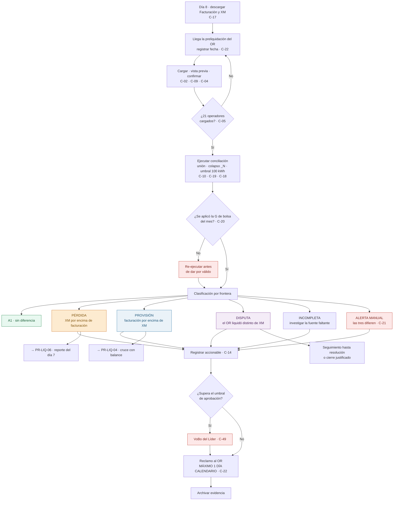

# PR-LIQ-02 · Conciliación de la Preliquidación SDL

| | |
|---|---|
| **Código** | PR-LIQ-02 |
| **Versión** | 1.0 |
| **Fecha de emisión** | 2026-08-31 |
| **Macroproceso** | Gestión Financiera › Liquidaciones |
| **Proceso** | Conciliación de la preliquidación del Sistema de Distribución Local (SDL) |
| **Criticidad** | **Alta** — proceso central del área y de mayor impacto económico |
| **Elaboró** | Área de Liquidaciones |
| **Revisó** | Líder de Liquidaciones |
| **Aprobó** | Vicepresidencia Financiera |
| **Frecuencia de revisión** | Semestral, o ante cambio de proceso o de sistema |
| **Estado** | Borrador para aprobación |

---

## 1. Objetivo

Conciliar, frontera por frontera, la preliquidación con que cada Operador de Red (OR) cobra el
uso de la red contra la energía **facturada por BIA** y contra la **reportada a XM**; determinar
el efecto económico de cada diferencia —**pérdida, provisión o disputa**—, reclamar al OR lo que
proceda dentro del plazo, y dejar constituida la posición que alimenta el reporte contable.

## 2. Alcance

**Incluye:** energía activa, energía reactiva penalizada inductiva, energía reactiva penalizada
capacitiva, nivel de tensión, propiedad de activos y factor M, de las fronteras de los **21
Operadores de Red** con preliquidación SDL, para un período de consumo determinado.

**No incluye:** el cobro por otros conceptos de transporte (ver
[PR-LIQ-03](./PR-LIQ-03-conciliacion-cot.md)), la liberación de provisiones contra balances (ver
[PR-LIQ-04](./PR-LIQ-04-balances-de-energia.md)) ni la emisión del reporte contable (ver
[PR-LIQ-06](./PR-LIQ-06-cierre-de-mes.md)).

## 3. Definiciones

| Término | Definición |
|---|---|
| **E_fac** | Energía activa facturada por BIA al usuario. |
| **E_xm** | Energía reportada a XM para esa frontera. **XM es el árbitro del proceso.** |
| **E_sdl** | Energía con que el OR liquida el uso de la red. |
| **Δ₁ (línea 1)** | `E_fac − E_xm`. Diferencia entre lo facturado y lo reportado. Genera **pérdida** o **provisión**. |
| **Δ₂ (línea 2)** | `E_xm − E_sdl`. Diferencia entre lo reportado y lo liquidado por el OR. Genera **disputa**. |
| **Umbral** | ±100 kWh por frontera. Por debajo, las fuentes se consideran iguales. |
| **Pérdida (contingencia L1)** | Diferencia irrecuperable por haber reportado a XM más energía de la facturada. Se valoriza con **G de bolsa**. |
| **Provisión** | Diferencia por causar, por haber facturado más de lo reportado a XM. Se valoriza con **G de facturación**. Se libera con el balance del OR. |
| **Disputa (L2)** | Diferencia reclamable al OR porque liquidó distinto de lo reportado a XM. |
| **Alerta manual** | Caso en que las tres fuentes difieren y no existe regla automática: exige análisis del analista. |
| **Factor M** | Factor de la preliquidación que debe coincidir con el aplicado en facturación. |

## 4. Documentos de referencia

- [Manual del Área de Liquidaciones](../01-manual-liquidaciones.md) — §8 reglas de valorización
- [Matriz de riesgos y controles](../04-matriz-de-control.md)
- [Riesgos de fraude](../05-riesgos-de-fraude.md)
- Criterio de universo de conciliación: `docs/backend/conciliacion-universo-union.md`

## 5. Responsabilidades

| Rol | R | A | C | I | Responsabilidad específica |
|---|:-:|:-:|:-:|:-:|---|
| **Analista de Liquidaciones** | ✔ | | | | Descarga las fuentes, carga las preliquidaciones, ejecuta la conciliación, analiza alertas manuales, registra accionables y reclama al OR |
| **Líder de Liquidaciones** | | ✔ | | | Aprueba los cierres sin ajuste y los `AJUSTE_NO_PROCEDE` sobre el umbral; verifica el cumplimiento de la ventana de respuesta |
| **Facturación (bills)** | | | ✔ | | Origen de la energía facturada y de las tarifas; ejecuta los ajustes solicitados |
| **Operaciones / Mercados** | | | ✔ | | Contraparte interna cuando la diferencia se origina en el reporte a XM |
| **Operador de Red** | | | ✔ | | Emite la preliquidación y responde el reclamo |
| **Contabilidad** | | | | ✔ | Recibe el efecto económico vía PR-LIQ-06 |

## 6. Entradas y salidas

| Entradas | Origen | Oportunidad |
|---|---|---|
| Facturación del período | bills / Metabase | **Día 8** |
| Reporte de energía a XM | XM / Metabase | **Día 8** |
| Preliquidación SDL por operador | Operadores de Red, por correo | Días 8 a 15 |
| Tarifas SDL del período | Insumos de cargos ADD y uso de red | Antes de conciliar |
| G de bolsa nacional del mes de consumo | Metabase | Antes de valorizar |

| Salidas | Destino | Oportunidad |
|---|---|---|
| Resultado por frontera con caso y valor | Módulo | Al conciliar |
| Provisiones constituidas | [PR-LIQ-04](./PR-LIQ-04-balances-de-energia.md) y [PR-LIQ-06](./PR-LIQ-06-cierre-de-mes.md) | Al conciliar |
| Pérdidas del período | [PR-LIQ-06](./PR-LIQ-06-cierre-de-mes.md) | Al conciliar |
| Disputas abiertas | Operador de Red | **≤ 1 día calendario** |
| Solicitudes de ajuste | Facturación (bills) | Dentro del ciclo |
| Insumo de indicadores | [PR-LIQ-08](./PR-LIQ-08-cierre-post-facturacion.md) | Al cierre |

## 7. Condiciones generales

1. **XM es el árbitro.** Si el dato de BIA coincide con XM, el que difiere es el OR y **se
   reclama**. Si el del OR coincide con XM, **no se refuta**. Si BIA difiere de XM, hay **pérdida**
   cuando XM está por encima y **provisión** cuando está por debajo. *(Política P-09 — no se
   negocia caso a caso.)*
2. **La referencia se fija antes de conocer el cobro.** Facturación y XM se descargan el día 8,
   antes de recibir las preliquidaciones. El orden es deliberado.
3. **Universo = unión de las tres fuentes**, cruzadas por código de frontera normalizado.
4. **Colapso de fronteras `_N`** obligatorio antes de comparar: agrupación por clave base, suma de
   energía activa y reactiva, herencia de nivel, propiedad, tarifa y factor M, y deduplicación
   previa a la suma. Sin este paso hay doble conteo.
5. **Umbral de materialidad: ±100 kWh** por frontera.
6. **Valorización:** `Δ energía × (G + T + D + PR + R)`. La **pérdida usa G de bolsa** y la
   **provisión usa G de facturación**; transmisión y restricciones son iguales para todas las
   fronteras del mes, y distribución y pérdidas son tarifas **por usuario**. La comercialización
   no participa. Excepción: cuando el OR liquida igual que BIA y XM difiere, la distribución se
   toma neta del cargo del OR.
7. **Un campo nulo frente a un campo con dato cuenta como diferencia**, no como coincidencia.
8. **La ventana de respuesta al OR es de un día calendario**, incluidos sábados, domingos y
   festivos.

## 8. Descripción del procedimiento

### 8.1 Preparación de la referencia (día 8)

| # | Actividad | Responsable | Sistema | Registro / evidencia | Control |
|:-:|---|---|---|---|:-:|
| 1 | **Descargar la facturación** del período de consumo y cargarla | Analista | Módulo / Metabase | Registro de carga | **C-17**, C-09 |
| 2 | **Descargar el reporte de energía a XM** del mismo período y cargarlo | Analista | Módulo / Metabase | Registro de carga | **C-17**, C-09 |
| 3 | **Verificar la disponibilidad de las tarifas SDL** del período y de la **G de bolsa** del mes de consumo | Analista | Módulo | Panel del período | **C-20** |

### 8.2 Cargue de la preliquidación (días 8 a 15)

| # | Actividad | Responsable | Sistema | Registro / evidencia | Control |
|:-:|---|---|---|---|:-:|
| 4 | **Registrar la fecha de recepción** de la preliquidación de cada OR: es el hito que inicia la ventana de un día | Analista | Correo / control del área | Bitácora de recepción | **C-22** |
| 5 | **Seleccionar el mes de consumo** y cargar el archivo del operador. El sistema rechaza el mes en curso y los futuros | Analista | Módulo | Registro de carga | **C-02** |
| 6 | **Revisar la vista previa**: número de fronteras, energías, y advertencias del sistema | Analista | Módulo | Vista previa | C-09 |
| 7 | Para los operadores que envían archivos complementarios en momentos distintos del mismo período, **usar la opción "agregar"**; en cualquier otro caso, reemplazar con justificación | Analista | Módulo | Historial de cargas | **C-03** |
| 8 | **Confirmar la carga** (append-only, con autor y fecha) | Analista | Módulo | Historial de cargas | **C-04** |
| 9 | **Verificar el avance `n/21`** en *Estado del período* | Analista | Módulo | Panel de estado | **C-05** |

### 8.3 Conciliación y clasificación

| # | Actividad | Responsable | Sistema | Registro / evidencia | Control |
|:-:|---|---|---|---|:-:|
| 10 | **Ejecutar la conciliación SDL.** El motor arma el universo por unión, colapsa las fronteras `_N`, obtiene la G de bolsa y clasifica cada frontera con umbral de 100 kWh | Analista | Módulo | Resultado de conciliación | **C-18, C-19, C-10, C-20** |
| 11 | **Verificar que la G de bolsa aplicada es la del mes de consumo.** Si la conciliación corrió sin ella, **re-ejecutar** antes de dar el resultado por bueno | Analista | Módulo | Valor de G en el panel | **C-20** |
| 12 | **Revisar la clasificación obtenida** por caso y su valorización (ver §9) | Analista | Módulo | Detalle por frontera | C-18 |
| 13 | **Analizar una a una las alertas manuales** —los casos donde las tres fuentes difieren— y documentar la conclusión | Analista | Módulo | Observación en la gestión | **C-21** |
| 14 | **Revisar las diferencias de los demás campos**: reactiva inductiva, reactiva capacitiva, factor M, nivel de tensión y propiedad | Analista | Módulo | Detalle por frontera | C-18 |
| 15 | **Revisar las fronteras `INCOMPLETA`** e identificar en qué fuente falta el dato; gestionar su obtención | Analista | Módulo | Detalle de incompletas | **C-10** |

### 8.4 Gestión y reclamo

| # | Actividad | Responsable | Sistema | Registro / evidencia | Control |
|:-:|---|---|---|---|:-:|
| 16 | **Registrar el accionable** de cada frontera con diferencia, con observación que sustente la decisión | Analista | Módulo | Registro de gestiones | **C-14** |
| 17 | **Obtener aprobación del Líder** para todo `AJUSTE_NO_PROCEDE` o cierre de disputa sin ajuste que supere el umbral definido | Líder | Correo / módulo | Aprobación documentada | **C-49** *(por implementar)* |
| 18 | **Exportar el detalle de las fronteras en disputa** y **enviar el reclamo al OR dentro del día siguiente a la recepción**, incluidos fines de semana y festivos | Analista | Módulo + correo | Correo con anexo y fecha | **C-22** |
| 19 | **Solicitar a Facturación el ajuste** de las fronteras clasificadas como error de BIA | Analista | Correo | Solicitud de ajuste | C-14 |
| 20 | **Escalar a Operaciones** las fronteras cuya diferencia se origine en el reporte a XM | Analista | Correo | Correo de escalamiento | C-14 |
| 21 | **Archivar la evidencia** del reclamo y de la respuesta del OR, asociada al período y a la frontera | Analista | Carpeta del área | Expediente del período | **C-22** |

### 8.5 Cierre del ciclo

| # | Actividad | Responsable | Sistema | Registro / evidencia | Control |
|:-:|---|---|---|---|:-:|
| 22 | **Verificar que toda frontera con diferencia tiene accionable** antes de dar por cerrado el período | Analista | Módulo | Panel de gestiones | **C-14** |
| 23 | **Confirmar la constitución de provisiones, pérdidas y disputas** del período y su consistencia con el detalle | Analista | Módulo | Resumen de conciliación | C-18 |
| 24 | **Entregar el resultado** como insumo del reporte contable y de los indicadores del ciclo | Analista | Informe del área | Informe mensual | C-33 |
| 25 | **Dar seguimiento a las disputas abiertas** hasta su resolución o cierre justificado | Analista | Módulo | Estado de la disputa | C-14 |

## 9. Matriz de clasificación y valorización

| Caso | Condición | Resultado | Valorización |
|---|---|---|---|
| **A1** | fac ≈ xm ≈ sdl | Sin diferencia | — |
| **B1** | fac < xm = sdl | **Pérdida** | `(xm−fac) × (G_bolsa + T + D + PR + R)` |
| **B1-ext** | fac ≈ sdl < xm | **Pérdida** | `(xm−fac) × (G_bolsa + T + (D − tarifa_sdl) + PR + R)` |
| **B2** | fac > xm = sdl | **Provisión** | `(fac−xm) × (G_bia + T + D + PR + R)` |
| **C1** | fac = xm > sdl | **Disputa** — el OR cobró de menos | `|Δ₂| × tarifa_sdl` |
| **C2** | fac = xm < sdl | **Disputa** — el OR cobró de más | `|Δ₂| × tarifa_sdl` |
| **D1** | fac < sdl < xm | **Pérdida + alerta manual** | como B1 |
| **D2** | fac > sdl > xm | **Provisión + alerta manual** | como B2 |
| **D3** | xm < fac = sdl | **Provisión**, distribución neta | `(fac−xm) × (G_bia + T + (D − tarifa_sdl) + PR + R)` |
| **D4** | los tres distintos | **Alerta manual** + pérdida o provisión según el signo | según corresponda |
| **INCOMPLETA** | falta XM o SDL | Sin clasificar; se investiga | — |

## 10. Diagrama de flujo

## 11. Puntos de control del procedimiento

| ID | Control | Objetivo | Naturaleza | Frecuencia | Responsable | Evidencia | Aserción | Prueba de auditoría | Estado |
|---|---|---|---|---|---|---|---|---|---|
| **C-17** | Descarga de Facturación y XM el día 8, previa a la preliquidación | Preventivo | Manual | Mensual | Analista | Fecha de las cargas | Corte · Integridad | Comparar la fecha de carga de Facturación y XM contra la de las preliquidaciones | 🟢 Opera |
| **C-02** | Bloqueo del mes en curso y de meses futuros | Preventivo | Automático | Por carga | Sistema | Rechazo | Corte | Intento controlado de cargue | 🟢 Opera |
| **C-03** | Justificación obligatoria al reemplazar | Preventivo | Automático | Por reemplazo | Analista | Historial | Autorización | Revisar los reemplazos del trimestre | 🟡 Sin segundo par de ojos |
| **C-04** | Append-only con autor y fecha | Detectivo | Automático | Por carga | Sistema | Historial | Existencia | Trazabilidad de 3 cargas | 🟢 Opera |
| **C-05** | Completitud `n/21` | Detectivo | Automático | Continuo | Analista | Panel | Integridad | Completitud al momento de conciliar | 🟢 Opera |
| **C-10** | Universo = unión de las tres fuentes | Detectivo | Automático | Mensual | Sistema | Detalle de incompletas | Integridad | Total ≥ fronteras distintas de cada fuente | 🟢 Opera |
| **C-19** | Colapso `_N` con herencia y deduplicación | Preventivo | Automático | Mensual | Sistema | Detalle por frontera | Exactitud | Verificar una frontera con variantes y su suma | 🟢 Opera |
| **C-18** | Clasificación A1–D4 con umbral y valorización por caso | Detectivo | Automático | Mensual | Sistema | Resultado | Exactitud · Valuación | Recalcular a mano una frontera por cada caso | 🟢 Opera |
| **C-20** | G de bolsa del mes aplicada a todas las fronteras; re-ejecución si faltaba | Preventivo | Híbrido | Mensual | Analista | Valor de G en el panel | Valuación | Contrastar la G usada contra la publicada del mes | 🟡 **Fallback silencioso** |
| **C-21** | Revisión obligatoria de alertas manuales | Detectivo | Manual | Por frontera | Analista | Observación en la gestión | Exactitud | Muestra de alertas: ¿tienen conclusión documentada? | 🟡 Marca sin bloqueo |
| **C-14** | Accionable obligatorio por frontera con diferencia | Detectivo | Manual | Por diferencia | Analista | Registro de gestiones | Existencia | Muestra de 25 fronteras | 🟡 Sin revisión independiente |
| **C-22** | Reclamo al OR dentro de un día calendario, con evidencia | Preventivo | Manual | Por operador | Analista | Correo con fecha | Existencia | Comparar fecha de recepción vs. fecha de reclamo | 🔴 **Sin medición ni evidencia en el sistema** |
| **C-49** | Aprobación del Líder sobre el umbral para `AJUSTE_NO_PROCEDE` y cierres sin ajuste | Preventivo | Manual | Por caso | Líder | Aprobación documentada | Autorización | Listar los cierres del trimestre y su aprobación | 🔴 **Por implementar** |

## 12. Riesgos del procedimiento

| ID | Riesgo | Nivel | Control mitigante |
|---|---|---|---|
| **R-07** | Aceptar un cobro del OR superior al que corresponde | Alto | C-18, C-21, C-14, C-22 |
| **R-08** | Valorización errada de la pérdida por G de bolsa | Alto | C-20 — con fallback silencioso |
| **R-09** | Diferencia detectada y no reclamada dentro del plazo | Crítico | C-22 — **sin evidencia en el sistema** |
| **R-10** | Provisiones constituidas y sin seguimiento posterior | Crítico | Ver [PR-LIQ-04](./PR-LIQ-04-balances-de-energia.md) |
| **R-02** | Incumplimiento del plazo por concentración del calendario | Crítico | C-22 |
| **R-03** | Conciliar con preliquidaciones incompletas | Crítico | C-05, C-10 |
| **F-01** | Cierre indebido de disputas en favor del OR | Alto | C-14 + **C-49 por implementar** |
| **F-09** | Manipulación de insumos tarifarios que cambia el valor de las diferencias | Medio-Alto | Comparación de tarifas contra el período anterior *(por implementar)* |
| **F-10** | Omisión deliberada de carga para que las fronteras queden incompletas y no generen pérdida | Alto | C-05 + completitud incorporada al indicador *(por implementar)* |

## 13. Indicadores del procedimiento

| Indicador | Fórmula | Meta | Frecuencia |
|---|---|---|---|
| Oportunidad de respuesta al OR | Reclamos enviados dentro del día siguiente / total | ≥ 95 % | Mensual |
| Completitud al conciliar | Preliquidaciones cargadas / 21 | 100 % | Mensual |
| Cobertura de accionables | Fronteras con diferencia y accionable / total | 100 % | Mensual |
| Fronteras incompletas | Incompletas / universo | ≤ 2 % | Mensual |
| Valor en disputa recuperado | Disputas resueltas con ajuste / valor total en disputa | ≥ 80 % | Trimestral |
| Tasa de `AJUSTE_NO_PROCEDE` | Accionables de ese tipo / total, por analista y por OR | Vigilar desviaciones | Mensual |

## 14. Registros y retención

| Registro | Soporte | Retención | Responsable |
|---|---|---|---|
| Preliquidación recibida | Correo + carpeta del área | 5 años | Analista |
| Bitácora de fecha de recepción y de reclamo | Control del área | 5 años | Analista |
| Cargas de Facturación, XM y SDL | Base de datos, append-only | Permanente | Sistema |
| Resultado de conciliación por frontera | Base de datos | Permanente | Sistema |
| Provisiones, contingencias y disputas | Base de datos | Permanente | Sistema |
| Accionables | Base de datos | Permanente | Sistema |
| Reclamo al OR y su respuesta | Correo + carpeta del área | 5 años | Analista |

## 15. Contingencias

| Situación | Acción |
|---|---|
| **La preliquidación llega en fin de semana o festivo** | La ventana de un día **corre igual**. Debe existir cobertura del área para esos días; el turno se define al inicio del mes y se deja constancia. |
| **Metabase no entrega la G de bolsa del mes** | El motor aplica un valor alterno **sin avisar**. Registrar la incidencia, **no dar por válido el resultado** y re-ejecutar apenas se publique la G. Si el reporte contable ya salió, informar al Líder y reemitir. |
| **Un OR no envía la preliquidación** | Reclamar por escrito, escalar al Líder y conciliar con lo disponible. Sus fronteras quedan `INCOMPLETA` y **no se dan por conformes**. Documentar en el informe del ciclo. |
| **La conciliación devuelve resultados en cero** | Verificar que se está conciliando el período correcto —la clave es el **mes de consumo**, no el de facturación— antes de reportar a TI. |
| **Un caso no encaja en ninguna regla** | Se clasifica como alerta manual. **No se cierra por analogía:** se documenta la conclusión y, si supera el umbral, se eleva al Líder. |
| **El OR rechaza el reclamo alegando su propio dato** | Contrastar contra XM. Si el OR coincide con XM, **no se refuta** (política P-09). Si no, escalar y mantener la disputa abierta. |
| **Se detecta la diferencia después de vencida la ventana** | Reclamar igualmente, dejar constancia del motivo del retraso e incluirlo en el informe del ciclo. No se omite el reclamo por estar fuera de plazo. |

## 16. Control de cambios

| Versión | Fecha | Cambio | Autor |
|---|---|---|---|
| 1.0 | 2026-08-31 | Emisión inicial. Levantamiento del proceso vigente, del motor de clasificación y de los controles del módulo. | Área de Liquidaciones |
