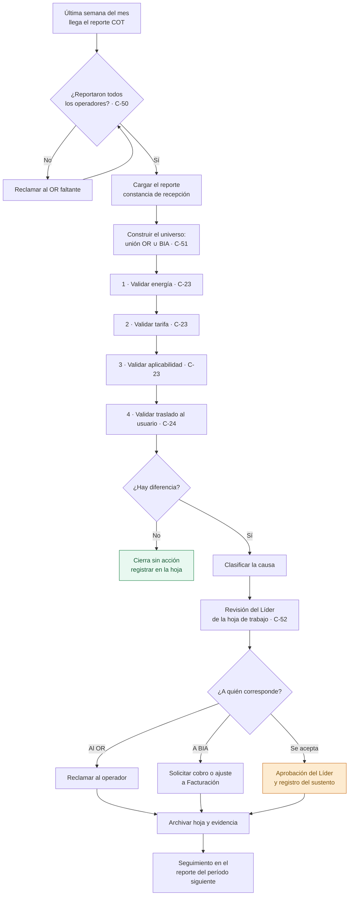

# PR-LIQ-03 · Conciliación del COT

| | |
|---|---|
| **Código** | PR-LIQ-03 |
| **Versión** | 1.0 |
| **Fecha de emisión** | 2026-08-31 |
| **Macroproceso** | Gestión Financiera › Liquidaciones |
| **Proceso** | Conciliación del cobro por otros conceptos de transporte (COT) |
| **Criticidad** | **Alta** — el proceso se ejecuta sin soporte de sistema |
| **Elaboró** | Área de Liquidaciones |
| **Revisó** | Líder de Liquidaciones |
| **Aprobó** | Vicepresidencia Financiera |
| **Frecuencia de revisión** | Semestral, o al implementarse el motor de conciliación COT |
| **Estado** | Borrador para aprobación |

---

> **Advertencia de control.** Este procedimiento **se ejecuta íntegramente fuera del módulo de
> Liquidaciones**. El sistema permite cargar el archivo del operador, pero **no existe motor de
> conciliación COT**: el módulo de Gestiones devuelve siempre una lista vacía para este concepto.
> En consecuencia, todos los controles de este procedimiento son **manuales**, y su evidencia
> depende de que la hoja de trabajo definida en §9 se diligencie y se conserve. Ver brecha
> [B-02](../06-brechas-y-plan.md).

## 1. Objetivo

Validar que el cobro que el Operador de Red (OR) realiza por COT sea **correcto en energía,
tarifa y aplicabilidad**, y que **lo cobrado por el OR corresponda con lo que BIA cobró al
usuario final**, gestionando con el operador toda diferencia detectada.

## 2. Alcance

**Incluye:** la validación del cobro de COT reportado por los Operadores de Red para un período
determinado: verificación de energía, verificación de tarifa, verificación de aplicabilidad del
usuario, contraste contra lo facturado por BIA y gestión de diferencias.

**No incluye:** la conciliación de uso de red (ver
[PR-LIQ-02](./PR-LIQ-02-preliquidacion-sdl.md)), el cobro al usuario (lo ejecuta Facturación) ni
el registro contable.

## 3. Definiciones

| Término | Definición |
|---|---|
| **COT** | Cobro que el Operador de Red realiza por otros conceptos de transporte asociados a la frontera. |
| **Aplicabilidad** | Condición por la cual un usuario **está sujeto** al cobro de COT. Un usuario que no aplica no debe ser cobrado por el OR ni por BIA. |
| **Traslado** | Cobro del concepto al usuario final en su factura, correspondiente a lo que el OR cobra a BIA. |
| **Hoja de trabajo COT** | Registro de trabajo definido en §9. **Es la única evidencia del análisis** mientras el proceso no esté sistematizado. |

## 4. Documentos de referencia

- [Manual del Área de Liquidaciones](../01-manual-liquidaciones.md)
- [Matriz de riesgos y controles](../04-matriz-de-control.md)
- [Brechas y plan de remediación](../06-brechas-y-plan.md) — brecha B-02

## 5. Responsabilidades

| Rol | R | A | C | I | Responsabilidad específica |
|---|:-:|:-:|:-:|:-:|---|
| **Analista de Liquidaciones** | ✔ | | | | Recibe el reporte, ejecuta las cuatro validaciones, diligencia la hoja de trabajo y gestiona diferencias |
| **Líder de Liquidaciones** | | ✔ | | | Revisa la hoja de trabajo, aprueba las diferencias aceptadas y las no reclamadas |
| **Facturación (bills)** | | | ✔ | | Origen de lo cobrado al usuario; ejecuta el cobro o el ajuste cuando corresponde |
| **Operador de Red** | | | ✔ | | Emite el reporte y responde el reclamo |
| **Contabilidad** | | | | ✔ | Informada del efecto de las diferencias aceptadas |

## 6. Entradas y salidas

| Entradas | Origen | Oportunidad |
|---|---|---|
| Reporte COT del operador | Operadores de Red, por correo | Última semana del mes y primera del siguiente |
| Facturación del período | bills / Metabase | Disponible desde el día 8 |
| Universo de usuarios sujetos al cobro | Facturación / información comercial | Al iniciar la validación |
| Tarifa vigente del concepto | Regulación / reporte del OR | Al iniciar la validación |

| Salidas | Destino | Oportunidad |
|---|---|---|
| Hoja de trabajo COT diligenciada y revisada | Expediente del período | Al cierre de la validación |
| Reclamo al OR por diferencias | Operador de Red | Dentro del ciclo |
| Solicitud de cobro o ajuste al usuario | Facturación (bills) | Dentro del ciclo |
| Reporte de diferencias aceptadas | Contabilidad / Líder | Al cierre |

## 7. Condiciones generales

1. **Las cuatro validaciones son obligatorias y no se sustituyen entre sí:** energía, tarifa,
   aplicabilidad y correspondencia con lo cobrado al usuario. Que la energía cuadre no acredita
   que el usuario aplique.
2. **El universo de validación es la unión** de los usuarios que el OR cobra y de los que BIA
   cobró. Un usuario presente en una sola de las dos listas **es una diferencia**, no una omisión:
   revela un cobro sin traslado o un traslado sin cobro.
3. **Ninguna diferencia se acepta sin sustento documental.** La aceptación de una diferencia
   —esto es, no reclamarla— requiere aprobación del Líder cuando supere el umbral definido.
4. **La hoja de trabajo es el registro de control del procedimiento** y se conserva por período
   con la evidencia del reclamo.

## 8. Descripción del procedimiento

| # | Actividad | Responsable | Sistema | Registro / evidencia | Control |
|:-:|---|---|---|---|:-:|
| 1 | **Recibir el reporte COT** de cada operador y registrar la fecha de recepción | Analista | Correo | Bitácora de recepción | C-50 |
| 2 | **Verificar la completitud**: que hayan reportado todos los operadores que cobran el concepto en el período | Analista | Control del área | Bitácora de recepción | **C-50** |
| 3 | **Cargar el reporte** en el módulo para dejar constancia de la recepción (el sistema lo almacena; no lo concilia) | Analista | Módulo | Historial de cargas | C-04 |
| 4 | **Construir el universo** de la hoja de trabajo: unión de los usuarios cobrados por el OR y de los cobrados por BIA en el período | Analista | Hoja de trabajo | Hoja de trabajo, columna origen | **C-51** |
| 5 | **Validar la energía**: contrastar la energía con que el OR liquida el COT contra la del período conciliado para esa frontera | Analista | Hoja de trabajo | Columnas de energía y diferencia | **C-23** |
| 6 | **Validar la tarifa**: verificar que la tarifa aplicada por el OR sea la que corresponde al período y al usuario | Analista | Hoja de trabajo | Columnas de tarifa y diferencia | **C-23** |
| 7 | **Validar la aplicabilidad**: verificar que cada usuario cobrado **efectivamente aplique** para el cobro | Analista | Hoja de trabajo | Columna de aplicabilidad | **C-23** |
| 8 | **Validar el traslado**: verificar que a cada usuario que aplica **se le haya cobrado** en su factura | Analista | Hoja de trabajo | Columna de traslado | **C-24** |
| 9 | **Contrastar lo cobrado por el OR contra lo cobrado por BIA** y cuantificar la diferencia en pesos por usuario y en total | Analista | Hoja de trabajo | Columna de diferencia en pesos | **C-24** |
| 10 | **Clasificar cada diferencia**: cobro del OR por usuario que no aplica · error de tarifa · error de energía · falta de traslado al usuario · cobro al usuario sin cobro del OR | Analista | Hoja de trabajo | Columna de causa | C-24 |
| 11 | **Someter la hoja de trabajo a revisión del Líder**, quien verifica el universo, las cuatro validaciones y la clasificación de las diferencias | Líder | Hoja de trabajo | Firma o visto documentado | **C-52** *(por implementar)* |
| 12 | **Reclamar al OR** las diferencias que le corresponden, con el detalle por usuario | Analista | Correo | Correo con anexo | C-24 |
| 13 | **Solicitar a Facturación** el cobro o el ajuste al usuario cuando la causa sea de BIA | Analista | Correo | Solicitud de ajuste | C-24 |
| 14 | **Registrar las diferencias aceptadas** —las que no se reclaman— con su justificación y la aprobación del Líder | Líder | Hoja de trabajo | Aprobación documentada | **C-52** |
| 15 | **Archivar** el reporte del OR, la hoja de trabajo revisada y la evidencia del reclamo, asociados al período | Analista | Carpeta del área | Expediente del período | C-51 |
| 16 | **Dar seguimiento** a las diferencias reclamadas hasta su corrección en el reporte del período siguiente | Analista | Hoja de trabajo | Columna de seguimiento | C-24 |

## 9. Hoja de trabajo COT — contenido mínimo obligatorio

Mientras el proceso no esté sistematizado, **este es el registro de control del procedimiento**.
Debe existir una hoja por período, con una fila por usuario o frontera del universo:

| Campo | Contenido |
|---|---|
| Período de consumo | Mes al que corresponde el cobro |
| Operador de Red | Código del operador |
| Frontera / usuario | Identificación del punto y del usuario |
| **Origen** | Cobrado por el OR · cobrado por BIA · ambos |
| Energía del OR | kWh sobre los que el OR liquida |
| Energía conciliada | kWh del período según la conciliación |
| Diferencia de energía | Cálculo y observación |
| Tarifa aplicada por el OR | Valor unitario |
| Tarifa que corresponde | Valor unitario de referencia |
| **¿El usuario aplica?** | Sí / No, con sustento |
| **¿Se le cobró al usuario?** | Sí / No, con referencia a la factura |
| Valor cobrado por el OR | COP |
| Valor cobrado por BIA | COP |
| **Diferencia en pesos** | COP |
| **Causa** | Clasificación del paso 10 |
| **Decisión** | Reclamar · aceptar · ajustar en facturación |
| Aprobación | Requerida cuando la decisión es *aceptar* sobre el umbral |
| Seguimiento | Estado y fecha de cierre |

## 10. Diagrama de flujo

## 11. Puntos de control del procedimiento

| ID | Control | Objetivo | Naturaleza | Frecuencia | Responsable | Evidencia | Aserción | Prueba de auditoría | Estado |
|---|---|---|---|---|---|---|---|---|---|
| **C-50** | Verificación de completitud de los reportes COT recibidos | Detectivo | Manual | Mensual | Analista | Bitácora de recepción | Integridad | Contrastar operadores que cobran vs. reportes recibidos | 🔴 Por formalizar |
| **C-51** | Universo de validación = unión de lo cobrado por el OR y por BIA | Preventivo | Manual | Mensual | Analista | Hoja de trabajo, columna origen | Integridad | Verificar que la hoja incluye usuarios de un solo lado | 🔴 Por formalizar |
| **C-23** | Validación de energía, tarifa y aplicabilidad | Detectivo | Manual | Mensual | Analista | Hoja de trabajo | Exactitud | Recalcular 15 usuarios de la hoja | 🔴 Manual, sin evidencia estructurada |
| **C-24** | Contraste de lo cobrado por el OR contra lo cobrado al usuario | Detectivo | Manual | Mensual | Analista | Hoja de trabajo | Integridad | Trazar 10 usuarios desde el reporte del OR hasta la factura | 🔴 Manual |
| **C-52** | Revisión y aprobación de la hoja de trabajo por el Líder, incluida toda diferencia aceptada | Preventivo | Manual | Mensual | Líder | Visto documentado | Autorización | Verificar la aprobación de las diferencias no reclamadas del trimestre | 🔴 **Por implementar** |
| **C-04** | Constancia de la recepción del reporte en el sistema | Detectivo | Automático | Por carga | Sistema | Historial de cargas | Existencia | Verificar la carga del período | 🟢 Opera |

## 12. Riesgos del procedimiento

| ID | Riesgo | Nivel | Control mitigante |
|---|---|---|---|
| **R-11** | El OR cobra COT por usuarios que no aplican | Alto | C-23 — manual |
| **R-12** | BIA no traslada al usuario un COT que sí le cobran (fuga de margen directa) | Alto | C-24 — manual |
| **R-13** | Falta de trazabilidad del análisis: imposible auditar o reconstruir la decisión | Alto | C-51, C-52 — **por formalizar** |
| **F-01** | Aceptación indebida de un cobro del OR sin sustento | Alto | C-52 — **por implementar** |
| **F-06** | Cobro al usuario sin correspondencia con lo cobrado por el OR | Medio | C-24 |

## 13. Indicadores del procedimiento

| Indicador | Fórmula | Meta | Frecuencia |
|---|---|---|---|
| Completitud de reportes | Reportes recibidos / operadores que cobran el concepto | 100 % | Mensual |
| Cobertura de la validación | Usuarios validados / universo de la hoja | 100 % | Mensual |
| Diferencias reclamadas | Valor reclamado / valor total en diferencia | ≥ 90 % | Mensual |
| Usuarios cobrados por el OR sin traslado | Cantidad y valor | Cero | Mensual |
| Usuarios cobrados sin aplicar | Cantidad y valor | Cero | Mensual |
| Oportunidad de cierre | Períodos cerrados dentro de la primera semana de M+2 | 100 % | Mensual |

## 14. Registros y retención

| Registro | Soporte | Retención | Responsable |
|---|---|---|---|
| Reporte COT del operador | Correo + carpeta del área | 5 años | Analista |
| Constancia de carga | Base de datos | Permanente | Sistema |
| **Hoja de trabajo COT revisada** | Carpeta controlada del área | 5 años | Analista / Líder |
| Reclamo al OR y respuesta | Correo | 5 años | Analista |
| Solicitudes a Facturación | Correo | 5 años | Analista |
| Aprobación de diferencias aceptadas | Correo o visto en la hoja | 5 años | Líder |

## 15. Contingencias

| Situación | Acción |
|---|---|
| **Un OR no envía el reporte** | Reclamar por escrito y escalar al Líder. **No se da por conforme el período** de ese operador; se deja constancia en la hoja de trabajo. |
| **No se dispone del universo de usuarios que aplican** | Solicitarlo formalmente a Facturación antes de validar. **No se valida la aplicabilidad por inferencia**; si no hay insumo, se documenta la limitación en la hoja y se informa al Líder. |
| **La tarifa de referencia no está disponible** | Validar energía, aplicabilidad y traslado, dejar la tarifa como pendiente y cerrarla apenas se disponga del dato. No se cierra el período con la validación incompleta sin decirlo. |
| **La diferencia se detecta después de facturado el período** | Se reclama igual al OR y se gestiona el ajuste al usuario en el período siguiente, dejando constancia. |
| **El OR rechaza el reclamo** | Registrar la respuesta y su sustento, escalar al Líder y decidir si se acepta —con aprobación— o se mantiene. |

## 16. Control de cambios

| Versión | Fecha | Cambio | Autor |
|---|---|---|---|
| 1.0 | 2026-08-31 | Emisión inicial. Formalización de un proceso que hoy se ejecuta sin soporte de sistema; se define la hoja de trabajo como registro de control. | Área de Liquidaciones |
