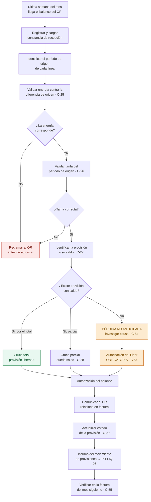
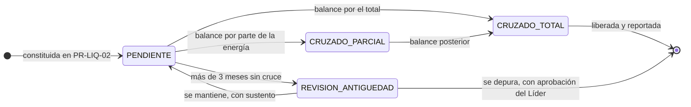

# PR-LIQ-04 · Validación y Cruce de Balances de Energía

| | |
|---|---|
| **Código** | PR-LIQ-04 |
| **Versión** | 1.0 |
| **Fecha de emisión** | 2026-08-31 |
| **Macroproceso** | Gestión Financiera › Liquidaciones |
| **Proceso** | Validación de balances de energía del OR y cruce contra provisiones |
| **Criticidad** | **Alta** — el resultado autoriza un cobro del operador y libera una provisión contable |
| **Elaboró** | Área de Liquidaciones |
| **Revisó** | Líder de Liquidaciones |
| **Aprobó** | Vicepresidencia Financiera |
| **Frecuencia de revisión** | Semestral, o al sistematizarse el cruce |
| **Estado** | Borrador para aprobación |

---

## 1. Objetivo

Validar los balances con que el Operador de Red cobra **energía no cobrada en meses anteriores**
—originada en un reporte a XM inferior al real—, verificar que la energía y la tarifa sean las
correctas, **cruzarlos contra las provisiones constituidas** y autorizar su relación en la
factura del mes siguiente.

## 2. Alcance

**Incluye:** recepción, validación de energía y tarifa, cruce contra la provisión de la frontera y
del período de origen, autorización al operador, y reporte del efecto a Contabilidad.

**No incluye:** la constitución de la provisión (se origina en
[PR-LIQ-02](./PR-LIQ-02-preliquidacion-sdl.md)), el registro contable ni el pago.

## 3. Definiciones

| Término | Definición |
|---|---|
| **Balance de energía** | Cobro del OR por energía de un período **ya facturado**, dejada de reportar a XM en su momento. |
| **Período de origen** | Mes de consumo al que corresponde la energía del balance. **Es el período cuya tarifa aplica**, no el del mes en curso. |
| **Provisión** | Posición constituida en la conciliación SDL cuando BIA facturó más de lo reportado a XM. Es el pasivo que el balance viene a consumir. |
| **Cruce** | Aplicación del balance contra la provisión de la misma frontera y período de origen. |
| **Cruce total / parcial** | El balance consume la provisión completa, o solo una parte y deja saldo. |
| **Pérdida no anticipada** | Balance sin provisión que lo respalde: el OR cobra energía que BIA no había previsto. |

## 4. Documentos de referencia

- [Manual del Área de Liquidaciones](../01-manual-liquidaciones.md) — §8 reglas de valorización
- [PR-LIQ-02](./PR-LIQ-02-preliquidacion-sdl.md) — origen de las provisiones
- [PR-LIQ-06](./PR-LIQ-06-cierre-de-mes.md) — movimiento de provisiones reportado
- [Brechas y plan](../06-brechas-y-plan.md) — brecha B-03

## 5. Responsabilidades

| Rol | R | A | C | I | Responsabilidad específica |
|---|:-:|:-:|:-:|:-:|---|
| **Analista de Liquidaciones** | ✔ | | | | Recibe, valida energía y tarifa, ejecuta el cruce y prepara la autorización |
| **Líder de Liquidaciones** | | ✔ | | | **Autoriza el balance**; aprueba obligatoriamente los balances sin provisión previa |
| **Contabilidad** | | | ✔ | | Recibe el efecto del cruce en el reporte de cierre |
| **Operador de Red** | | | ✔ | | Emite el balance y lo relaciona en factura una vez autorizado |

## 6. Entradas y salidas

| Entradas | Origen | Oportunidad |
|---|---|---|
| Balance de energía | Operadores de Red, por correo | Última semana del mes |
| Provisiones vigentes por frontera y período | Módulo (conciliación SDL) | Al validar |
| Tarifas aplicadas en la facturación del período de origen | Facturación | Al validar |
| Conciliación del período de origen | Módulo | Al validar |

| Salidas | Destino | Oportunidad |
|---|---|---|
| Balance validado y autorizado | Operador de Red | Antes del cierre del mes |
| Registro del cruce contra la provisión | Módulo / hoja de trabajo | Al validar |
| Efecto en el movimiento de provisiones | [PR-LIQ-06](./PR-LIQ-06-cierre-de-mes.md) | Día 7 siguiente |
| Reporte de pérdidas no anticipadas | Líder / Contabilidad | Al detectarse |

## 7. Condiciones generales

1. **Ningún balance se autoriza sin cruce.** La autorización exige haber identificado la provisión
   que lo respalda, o haber documentado su ausencia y obtenido aprobación del Líder.
2. **La tarifa que aplica es la del período de origen**, no la del mes en curso.
3. **La energía del balance no puede exceder la diferencia registrada** en la conciliación del
   período de origen. Si la excede, se reclama antes de autorizar.
4. **Una provisión no se cruza dos veces.** Antes de aplicar un balance se verifica el saldo
   disponible de la provisión.
5. **Un balance sin provisión previa es una pérdida no anticipada:** se investiga su causa antes
   de autorizarlo, no se aprueba por defecto.
6. Las provisiones sin cruce se revisan **por antigüedad**; las que superen tres meses se
   analizan y se reportan al Líder.

## 8. Descripción del procedimiento

| # | Actividad | Responsable | Sistema | Registro / evidencia | Control |
|:-:|---|---|---|---|:-:|
| 1 | **Recibir el balance** y registrar operador, período de origen, fronteras y valor | Analista | Correo / hoja de trabajo | Bitácora de recepción | C-53 |
| 2 | **Cargar el balance** en el módulo para dejar constancia de la recepción | Analista | Módulo | Historial de cargas | C-04 |
| 3 | **Identificar el período de origen** de cada línea del balance y verificar que corresponda a un período **ya facturado** | Analista | Hoja de trabajo | Columna de período | C-53 |
| 4 | **Validar la energía**: contrastar los kWh del balance contra la diferencia registrada en la conciliación del período de origen para esa frontera | Analista | Módulo + hoja de trabajo | Columnas de energía y diferencia | **C-25** |
| 5 | **Validar la tarifa**: verificar que la aplicada sea la del **período de origen** y que corresponda al usuario | Analista | Facturación + hoja de trabajo | Columnas de tarifa | **C-26** |
| 6 | **Identificar la provisión** constituida para esa frontera y período, y su **saldo disponible** | Analista | Módulo | Estado de la provisión | **C-27** |
| 7 | **Ejecutar el cruce** y determinar el resultado: total, parcial, o **sin provisión previa** | Analista | Módulo / hoja de trabajo | Registro del cruce | **C-27** |
| 8 | Si el resultado es **sin provisión previa**, **investigar la causa** —frontera no conciliada, diferencia no detectada, período no cargado— y documentarla | Analista | Hoja de trabajo | Análisis de causa | **C-54** |
| 9 | **Someter el balance a autorización del Líder.** Los balances sin provisión previa **requieren aprobación expresa** | Líder | Correo / hoja de trabajo | Autorización documentada | **C-54** *(por implementar)* |
| 10 | **Reclamar al OR** las líneas con energía o tarifa incorrectas, antes de autorizar el resto | Analista | Correo | Correo con anexo | C-25, C-26 |
| 11 | **Comunicar la autorización al OR** para que relacione el balance en la factura del mes siguiente | Analista | Correo | Correo de autorización | C-54 |
| 12 | **Actualizar el estado de la provisión**: liberada total o parcialmente, con el saldo remanente | Analista | Módulo / hoja de trabajo | Estado de la provisión | **C-27** |
| 13 | **Entregar el efecto del cruce** como insumo del movimiento de provisiones del reporte de cierre | Analista | Informe del área | Anexo del reporte | C-34 |
| 14 | **Revisar la antigüedad de las provisiones** sin cruce y reportar al Líder las que superen tres meses | Analista | Módulo / hoja de trabajo | Reporte de antigüedad | **C-28** *(por implementar)* |
| 15 | **Verificar en la factura del mes siguiente** que el balance se relacionó por el valor autorizado | Analista | Factura del OR | Verificación documentada | C-55 |
| 16 | **Archivar** balance, hoja de trabajo, autorización y evidencia de la verificación | Analista | Carpeta del área | Expediente del período | C-53 |

## 9. Diagrama de flujo

### Ciclo de vida de la provisión

## 10. Puntos de control del procedimiento

| ID | Control | Objetivo | Naturaleza | Frecuencia | Responsable | Evidencia | Aserción | Prueba de auditoría | Estado |
|---|---|---|---|---|---|---|---|---|---|
| **C-53** | Registro de recepción de balances con operador, período de origen y valor | Detectivo | Manual | Por balance | Analista | Bitácora | Integridad | Contrastar balances recibidos vs. autorizados del trimestre | 🔴 Por formalizar |
| **C-25** | Validación de la energía del balance contra la diferencia del período de origen | Detectivo | Manual | Por balance | Analista | Hoja de trabajo | Exactitud | Recalcular 5 líneas contra la conciliación de origen | 🔴 Manual |
| **C-26** | Validación de la tarifa del período de origen | Detectivo | Manual | Por balance | Analista | Hoja de trabajo | Valuación | Verificar la tarifa de 5 líneas contra la facturación de origen | 🔴 Manual |
| **C-27** | Cruce balance ↔ provisión con estado y saldo | Detectivo | Automático | Por balance | Sistema | Registro del cruce | Integridad · Valuación | Recomponer el movimiento de provisiones del trimestre | 🔴 **Modelado, no operado** |
| **C-54** | Autorización del Líder, obligatoria para balances sin provisión previa | Preventivo | Manual | Por balance | Líder | Autorización documentada | Autorización | Listar balances sin provisión y verificar su aprobación | 🔴 **Por implementar** |
| **C-28** | Reporte de antigüedad de provisiones sin cruce | Detectivo | Automático | Mensual | Líder | Reporte de antigüedad | Valuación | Solicitar el reporte y revisar las partidas de más de 3 meses | 🔴 **No existe** |
| **C-55** | Verificación de la relación del balance en la factura del mes siguiente | Detectivo | Manual | Por balance | Analista | Verificación documentada | Existencia | Trazar 5 balances autorizados hasta la factura | 🔴 Por formalizar |
| **C-04** | Constancia de la recepción del balance en el sistema | Detectivo | Automático | Por carga | Sistema | Historial de cargas | Existencia | Verificar la carga del período | 🟢 Opera |

## 11. Riesgos del procedimiento

| ID | Riesgo | Nivel | Control mitigante |
|---|---|---|---|
| **R-14** | Pagar energía ya pagada (doble cobro del OR vía balance) | Alto | C-25, C-27 — **C-27 no se opera** |
| **R-15** | Balance liquidado con la tarifa del mes en curso y no la del período de origen | Medio | C-26 |
| **R-10** | Provisiones sin seguimiento que nunca se liberan | Crítico | C-27, C-28 — **ambos pendientes** |
| **R-16** | Provisiones eternas que distorsionan los estados financieros | Alto | C-28 — **no existe** |
| **F-07** | Aprobación de balances sin respaldo y extinción indebida de derechos de cobro | Alto | C-54 — **por implementar** |
| **F-05** | Uso del movimiento de provisiones para trasladar resultado entre períodos | Alto | C-27, C-34, aprobación del reporte en PR-LIQ-06 |

## 12. Indicadores del procedimiento

| Indicador | Fórmula | Meta | Frecuencia |
|---|---|---|---|
| Balances validados antes de autorizar | Balances con hoja de trabajo completa / total | 100 % | Mensual |
| Balances sin provisión previa | Cantidad y valor | Vigilar; cada caso con análisis de causa | Mensual |
| Provisiones cruzadas en el mes | Valor cruzado / saldo inicial de provisiones | Informativo | Mensual |
| Antigüedad de provisiones | Provisiones sin cruce con más de 3 meses / total | ≤ 10 % | Mensual |
| Diferencias reclamadas en balances | Valor reclamado / valor observado | ≥ 90 % | Mensual |
| Balances relacionados por el valor autorizado | Verificados conformes / autorizados | 100 % | Mensual |

## 13. Registros y retención

| Registro | Soporte | Retención | Responsable |
|---|---|---|---|
| Balance recibido | Correo + carpeta del área | 5 años | Analista |
| Constancia de carga | Base de datos | Permanente | Sistema |
| Hoja de trabajo de validación y cruce | Carpeta controlada del área | 5 años | Analista |
| Registro del cruce y estado de la provisión | Base de datos | Permanente | Sistema |
| Autorización del Líder | Correo | 5 años | Líder |
| Comunicación de autorización al OR | Correo | 5 años | Analista |
| Verificación en factura | Carpeta del área | 5 años | Analista |

## 14. Contingencias

| Situación | Acción |
|---|---|
| **El balance no tiene provisión que lo respalde** | **No se autoriza de inmediato.** Se investiga la causa —frontera no conciliada, período no cargado, diferencia no detectada— y se eleva al Líder con el análisis. Se reconoce como pérdida no anticipada solo con su aprobación. |
| **La energía del balance excede la diferencia de origen** | Se reclama al OR el exceso antes de autorizar. Se autoriza únicamente la porción sustentada. |
| **No se ubica la conciliación del período de origen** | Verificar que se busca por **mes de consumo**. Si el período no fue conciliado, dejar constancia: es una señal de que la conciliación de ese mes quedó incompleta. |
| **El OR relaciona en factura un valor distinto del autorizado** | Objetar la factura, documentar la diferencia y escalar al Líder. No se ajusta el registro para que coincida. |
| **Llegan dos balances por el mismo concepto** | Verificar el saldo de la provisión antes de aplicar el segundo. **Una provisión no se cruza dos veces**; si ya está consumida, se rechaza el segundo cobro. |
| **Una provisión supera tres meses sin cruce** | Analizar su vigencia con el detalle de origen y reportarla al Líder. Su depuración requiere aprobación y queda documentada. |

## 15. Control de cambios

| Versión | Fecha | Cambio | Autor |
|---|---|---|---|
| 1.0 | 2026-08-31 | Emisión inicial. Formaliza el cruce contra provisiones como condición de la autorización. | Área de Liquidaciones |
