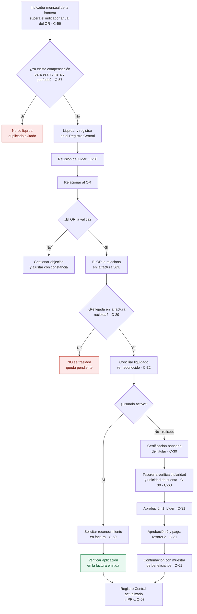

# PR-LIQ-05 · Liquidación y Traslado de Compensaciones

| | |
|---|---|
| **Código** | PR-LIQ-05 |
| **Versión** | 1.0 |
| **Fecha de emisión** | 2026-08-31 |
| **Macroproceso** | Gestión Financiera › Liquidaciones |
| **Proceso** | Liquidación de compensaciones por calidad del servicio y traslado al usuario |
| **Criticidad** | **Crítica** — único proceso del área que termina en una salida de efectivo hacia un tercero |
| **Elaboró** | Área de Liquidaciones |
| **Revisó** | Líder de Liquidaciones |
| **Aprobó** | Vicepresidencia Financiera |
| **Frecuencia de revisión** | Semestral, o ante cualquier cambio en el esquema de pago |
| **Estado** | Borrador para aprobación |

---

> **Advertencia de control.** Este procedimiento **no tiene soporte de sistema**: cálculo,
> relación al operador, verificación en factura, traslado y pago se ejecutan fuera del módulo.
> Combina un cálculo hecho por BIA, un beneficiario que puede ya no ser cliente, una cuenta
> bancaria informada por un canal no verificado y un pago. **Es la mayor exposición del área**
> (riesgo de fraude [F-04](../05-riesgos-de-fraude.md)). Los controles de segregación y de
> validación de titularidad definidos aquí **son obligatorios y no dependen de desarrollo**.

## 1. Objetivo

Liquidar la compensación que el Operador de Red debe al usuario por fallas en la prestación del
servicio, relacionarla ante el operador, **verificar que la reconozca en la factura SDL** y
**trasladarla íntegramente al usuario** —en su factura si está activo, o mediante pago bancario si
se retiró—, con trazabilidad completa desde el evento de calidad hasta el beneficiario final.

## 2. Alcance

**Incluye:** cálculo del indicador por frontera, liquidación de la compensación, relación al
operador, verificación de su reconocimiento en la factura SDL, traslado al usuario activo o
retirado, y registro para el reporte TC2.

**No incluye:** la medición de los indicadores de calidad del operador (los publica el OR y los
define la regulación), la emisión de la factura al usuario (Facturación) ni la ejecución material
del pago (Tesorería).

## 3. Definiciones

| Término | Definición |
|---|---|
| **Compensación** | Valor que el OR debe al usuario por fallas en la red que afectaron su servicio. El OR compensa al usuario **a través del comercializador**. |
| **Indicador del OR** | Meta anual de calidad de cada operador. Si el indicador mensual de una frontera lo supera, esa frontera **genera compensación**. |
| **Liquidación** | Cálculo del valor a compensar. **Lo realiza BIA**, no el operador. |
| **Reconocimiento** | Inclusión de la compensación por parte del OR en la factura SDL a BIA. |
| **Traslado** | Entrega de la compensación al usuario: en factura (activo) o por pago bancario (retirado). |
| **Usuario retirado** | Usuario que ya no es cliente de BIA. Su compensación se paga a una cuenta bancaria. |
| **Registro Central de Compensaciones** | Registro único definido en §9. Es el control maestro del procedimiento. |

## 4. Documentos de referencia

- [Manual del Área de Liquidaciones](../01-manual-liquidaciones.md) — política P-07
- [PR-LIQ-07](./PR-LIQ-07-reporte-tc2.md) — reporte a Contabilidad de este proceso
- [Riesgos de fraude](../05-riesgos-de-fraude.md) — F-04 y F-06
- Política corporativa de pagos a terceros y de prevención de fraude

## 5. Responsabilidades

| Rol | R | A | C | I | Responsabilidad específica |
|---|:-:|:-:|:-:|:-:|---|
| **Analista de Liquidaciones** | ✔ | | | | Calcula el indicador, liquida, relaciona al OR, verifica el reconocimiento y prepara el traslado. **No aprueba ni ejecuta pagos.** |
| **Líder de Liquidaciones** | | ✔ | | | Revisa la liquidación, **aprueba el traslado** y valida la titularidad antes de cualquier pago |
| **Tesorería** | ✔ | ✔ | | | **Verifica la titularidad de la cuenta y ejecuta el pago.** Segunda aprobación |
| **Facturación (bills)** | | | ✔ | | Aplica el reconocimiento en la factura del usuario activo |
| **Contabilidad** | | | | ✔ | Recibe el reporte TC2 y el registro del pasivo |
| **Operador de Red** | | | ✔ | | Valida la compensación y la relaciona en la factura SDL |

> **Regla de segregación (obligatoria):** **quien liquida no aprueba, y quien aprueba no paga.**
> El analista que calcula la compensación **no puede** informar ni modificar la cuenta bancaria de
> destino, aprobar el traslado ni ejecutar el pago.

## 6. Entradas y salidas

| Entradas | Origen | Oportunidad |
|---|---|---|
| Indicadores mensuales de calidad por frontera | Operador de Red / regulación | Mensual |
| Indicador anual del operador | Operador de Red / regulación | Anual |
| Estado del usuario (activo o retirado) | Facturación / información comercial | Al preparar el traslado |
| Factura SDL del operador | Operador de Red | Mensual |
| Datos bancarios del usuario retirado | Usuario, por canal formal | Al preparar el pago |

| Salidas | Destino | Oportunidad |
|---|---|---|
| Liquidación de compensaciones | Operador de Red | Mensual |
| Compensación reconocida en factura SDL | Registro central | Al recibir la factura |
| Reconocimiento en factura del usuario activo | Facturación | Ciclo de facturación |
| Pago a usuario retirado | Tesorería | Tras doble aprobación |
| Insumo del reporte TC2 | [PR-LIQ-07](./PR-LIQ-07-reporte-tc2.md) | Antes del día 15 |

## 7. Condiciones generales

1. **No se compensa al usuario antes de que el OR lo haya reconocido.** El traslado exige haber
   verificado la compensación **reflejada en la factura SDL** recibida.
2. **Toda compensación existe en el Registro Central**, tanto la de usuarios activos como la de
   retirados. Una compensación fuera del registro no se paga.
3. **Unicidad:** una misma frontera, usuario y período **genera una sola compensación**. Antes de
   liquidar se verifica que no exista ya una registrada.
4. **Doble vía prohibida:** una compensación se traslada **por una sola vía**, en factura o por
   pago. Nunca ambas.
5. **Validación de titularidad obligatoria:** todo pago a usuario retirado exige certificación
   bancaria **a nombre del titular** de la cuenta contratante. No se paga contra un dato informado
   por correo sin certificación.
6. **Doble aprobación obligatoria** para todo pago bancario: Líder de Liquidaciones y Tesorería.
7. **Cuenta bancaria única por beneficiario:** antes de pagar se verifica que la cuenta de destino
   **no esté asociada a otro usuario** del registro.
8. Las compensaciones reconocidas y **no trasladadas** son un **pasivo con el usuario** y se
   reportan como tal.

## 8. Descripción del procedimiento

### 8.1 Liquidación

| # | Actividad | Responsable | Sistema | Registro / evidencia | Control |
|:-:|---|---|---|---|:-:|
| 1 | **Obtener los indicadores mensuales** de calidad por frontera y el indicador anual del operador | Analista | Fuente del OR | Archivo del período | C-56 |
| 2 | **Identificar las fronteras que superan el indicador**, que son las que generan compensación | Analista | Hoja de liquidación | Hoja de liquidación | **C-56** |
| 3 | **Verificar la unicidad**: que ninguna de esas fronteras y períodos tenga ya una compensación registrada | Analista | Registro Central | Consulta al registro | **C-57** |
| 4 | **Liquidar la compensación** de cada frontera según la metodología regulatoria vigente | Analista | Hoja de liquidación | Hoja con memoria de cálculo | **C-56** |
| 5 | **Registrar cada compensación en el Registro Central** en estado *liquidada*, con frontera, usuario, período, valor y sustento | Analista | Registro Central | Registro Central | **C-57** |
| 6 | **Someter la liquidación a revisión del Líder** antes de relacionarla al operador | Líder | Registro Central | Visto documentado | **C-58** |

### 8.2 Relación y reconocimiento por el operador

| # | Actividad | Responsable | Sistema | Registro / evidencia | Control |
|:-:|---|---|---|---|:-:|
| 7 | **Relacionar la compensación al operador** con el detalle por frontera | Analista | Correo | Correo con anexo | C-56 |
| 8 | **Gestionar las observaciones del operador** y ajustar la liquidación si su objeción es procedente, dejando constancia del cambio | Analista | Correo / Registro Central | Trazabilidad del ajuste | C-58 |
| 9 | **Verificar en la factura SDL recibida** que la compensación quedó efectivamente reconocida, por frontera y valor | Analista | Factura del OR | Verificación documentada | **C-29** |
| 10 | **Actualizar el Registro Central** a estado *reconocida por el OR*, con la referencia de la factura | Analista | Registro Central | Registro Central | **C-57** |
| 11 | **Conciliar el total liquidado contra el total reconocido** por el operador en el período e investigar la diferencia | Analista | Registro Central | Conciliación documentada | **C-32** |

### 8.3 Traslado al usuario activo

| # | Actividad | Responsable | Sistema | Registro / evidencia | Control |
|:-:|---|---|---|---|:-:|
| 12 | **Confirmar que el usuario está activo** a la fecha del traslado | Analista | Facturación | Consulta documentada | C-59 |
| 13 | **Solicitar a Facturación el reconocimiento** en la factura del usuario, con frontera, período y valor | Analista | Correo | Solicitud | C-59 |
| 14 | **Verificar que el reconocimiento quedó aplicado** en la factura emitida | Analista | Facturación | Verificación documentada | **C-59** |
| 15 | **Actualizar el Registro Central** a estado *trasladada en factura* | Analista | Registro Central | Registro Central | C-57 |

### 8.4 Traslado al usuario retirado — pago bancario

| # | Actividad | Responsable | Sistema | Registro / evidencia | Control |
|:-:|---|---|---|---|:-:|
| 16 | **Confirmar la condición de retirado** y la ausencia de factura activa por la cual reconocer | Analista | Facturación | Consulta documentada | C-59 |
| 17 | **Solicitar al usuario, por canal formal, la certificación bancaria** a nombre del titular | Analista | Canal formal de la compañía | Certificación bancaria | **C-30** |
| 18 | **Verificar la titularidad**: que el titular de la cuenta corresponda al titular del contrato | **Tesorería** | Certificación bancaria | Verificación documentada | **C-30** |
| 19 | **Verificar que la cuenta no esté asociada a otro beneficiario** del Registro Central | **Tesorería** | Registro Central | Verificación documentada | **C-60** |
| 20 | **Aprobar el pago** — primera firma | **Líder** | Solicitud de pago | Aprobación documentada | **C-31** |
| 21 | **Aprobar y ejecutar el pago** — segunda firma | **Tesorería** | Sistema de pagos | Comprobante de pago | **C-31** |
| 22 | **Actualizar el Registro Central** a estado *trasladada por pago*, con la referencia del comprobante | Analista | Registro Central | Registro Central | C-57 |
| 23 | **Confirmar la recepción con una muestra de beneficiarios** del período | Líder | Canal formal | Constancia de confirmación | **C-61** *(por implementar)* |

### 8.5 Cierre del ciclo

| # | Actividad | Responsable | Sistema | Registro / evidencia | Control |
|:-:|---|---|---|---|:-:|
| 24 | **Identificar las compensaciones reconocidas y no trasladadas** y su antigüedad | Analista | Registro Central | Reporte de pendientes | **C-32** |
| 25 | **Entregar el insumo del reporte TC2**, distinguiendo activos y —como anexo de control— retirados | Analista | [PR-LIQ-07](./PR-LIQ-07-reporte-tc2.md) | Reporte TC2 y su anexo | **C-32** |
| 26 | **Archivar** liquidación, relación al operador, verificación en factura SDL, certificaciones, aprobaciones y comprobantes | Analista | Carpeta controlada | Expediente del período | C-57 |

## 9. Registro Central de Compensaciones — contenido mínimo obligatorio

Registro único, controlado y con acceso restringido, que cubre **activos y retirados**:

| Campo | Contenido |
|---|---|
| Identificador | Consecutivo único de la compensación |
| Período y frontera | Mes de origen y código de frontera |
| Operador de Red | Código del operador |
| Usuario | Identificación del titular del contrato |
| **Estado del usuario** | Activo · Retirado (con fecha de retiro) |
| Indicador del mes / indicador anual | Valores que sustentan la generación |
| Valor liquidado | COP, con memoria de cálculo |
| **Estado** | Liquidada · Relacionada al OR · Reconocida por el OR · Trasladada en factura · Trasladada por pago · Rechazada |
| Referencia del reconocimiento | Factura SDL en que el OR la reconoció |
| Vía de traslado | Factura · Pago bancario |
| **Cuenta de destino** | Solo para pago; con referencia a la certificación bancaria |
| **Verificación de titularidad** | Responsable y fecha |
| **Aprobación 1 / Aprobación 2** | Líder y Tesorería, con fecha |
| Comprobante de pago | Referencia |
| Antigüedad sin traslado | Días desde el reconocimiento |

## 10. Diagrama de flujo

## 11. Puntos de control del procedimiento

| ID | Control | Objetivo | Naturaleza | Frecuencia | Responsable | Evidencia | Aserción | Prueba de auditoría | Estado |
|---|---|---|---|---|---|---|---|---|---|
| **C-56** | Liquidación con memoria de cálculo trazable al indicador que la origina | Preventivo | Manual | Mensual | Analista | Hoja de liquidación | Exactitud | Recalcular 10 compensaciones desde el indicador | 🔴 Por formalizar |
| **C-57** | Registro Central único de compensaciones, con estado y unicidad por frontera, usuario y período | Detectivo | Manual | Continuo | Analista | Registro Central | Integridad · Existencia | Buscar duplicados por usuario y período | 🔴 **Por implementar** |
| **C-58** | Revisión del Líder de la liquidación antes de relacionarla al operador | Preventivo | Manual | Mensual | Líder | Visto documentado | Autorización | Verificar el visto de los períodos del trimestre | 🔴 Por formalizar |
| **C-29** | No trasladar al usuario antes de verificar el reconocimiento en la factura SDL | Preventivo | Manual | Por compensación | Analista | Factura SDL y verificación | Existencia | Trazar 10 traslados hasta la factura del OR | 🟡 Práctica sin registro |
| **C-32** | Conciliación entre lo liquidado, lo reconocido por el OR y lo trasladado al usuario | Detectivo | Manual | Mensual | Analista | Conciliación documentada | Integridad | Cuadrar los tres totales del período | 🟡 **Parcial: hoy excluye retirados** |
| **C-30** | Validación de titularidad con certificación bancaria, ejecutada por Tesorería | Preventivo | Manual | Por pago | Tesorería | Certificación y verificación | Autorización | Revisar la certificación de todos los pagos del trimestre | 🔴 **Por implementar — crítico** |
| **C-31** | Doble aprobación del pago: Líder y Tesorería, distintas de quien liquida | Preventivo | Manual | Por pago | Líder + Tesorería | Aprobaciones documentadas | Autorización | Verificar las dos firmas y que ninguna sea del liquidador | 🔴 **Por implementar — crítico** |
| **C-59** | Verificación del traslado efectivo al usuario activo en la factura emitida | Detectivo | Manual | Por compensación | Analista | Factura del usuario | Existencia | Trazar 10 compensaciones hasta la factura | 🔴 Por formalizar |
| **C-60** | Verificación de unicidad de la cuenta bancaria entre beneficiarios | Detectivo | Manual | Por pago | Tesorería | Verificación documentada | Existencia | Buscar cuentas repetidas en el registro | 🔴 **Por implementar** |
| **C-61** | Confirmación de recepción con una muestra de beneficiarios | Detectivo | Manual | Mensual | Líder | Constancia de confirmación | Existencia | Revisar las confirmaciones del trimestre | 🔴 **Por implementar** |

## 12. Riesgos del procedimiento

| ID | Riesgo | Nivel | Control mitigante |
|---|---|---|---|
| **F-04** | **Desvío del pago de compensaciones a usuarios retirados** hacia una cuenta distinta de la del titular | **Crítico** | C-30, C-31, C-60, C-61 — **todos por implementar** |
| **F-06** | Compensación ficticia o duplicada | Medio | C-57, C-32 |
| **R-17** | Compensación reconocida por el OR que nunca llega al usuario | Alto | C-29, C-32, C-59 |
| **R-18** | Doble compensación: en factura y por pago | Medio | C-57 — sin registro único no es detectable |
| **R-19** | Compensación mal liquidada | Medio | C-56, C-58 |
| **R-22** | Pasivo con el usuario no registrado | Medio | C-32 y [PR-LIQ-07](./PR-LIQ-07-reporte-tc2.md) |

## 13. Indicadores del procedimiento

| Indicador | Fórmula | Meta | Frecuencia |
|---|---|---|---|
| Reconocimiento del operador | Valor reconocido por el OR / valor liquidado | ≥ 95 % | Mensual |
| Oportunidad del traslado | Compensaciones trasladadas dentro del ciclo siguiente al reconocimiento / total | ≥ 95 % | Mensual |
| Compensaciones pendientes de traslado | Valor pendiente por antigüedad | Cero con más de 2 meses | Mensual |
| Pagos con doble aprobación completa | Pagos con las dos firmas / total de pagos | 100 % | Mensual |
| Pagos con certificación bancaria verificada | Pagos con certificación / total de pagos | 100 % | Mensual |
| Cuentas de destino repetidas | Cantidad detectada | Cero | Mensual |

## 14. Registros y retención

| Registro | Soporte | Retención | Responsable |
|---|---|---|---|
| Indicadores del operador y hoja de liquidación | Carpeta controlada | 5 años | Analista |
| **Registro Central de Compensaciones** | Archivo controlado con acceso restringido | Permanente | Líder |
| Relación al OR y su respuesta | Correo | 5 años | Analista |
| Verificación del reconocimiento en factura SDL | Carpeta del área | 5 años | Analista |
| **Certificación bancaria del titular** | Carpeta controlada con acceso restringido | 5 años | Tesorería |
| **Aprobaciones del pago** | Correo / sistema de pagos | 5 años | Líder y Tesorería |
| Comprobante de pago | Sistema de pagos | 5 años | Tesorería |
| Confirmación con beneficiarios | Carpeta del área | 5 años | Líder |

## 15. Contingencias

| Situación | Acción |
|---|---|
| **El OR no reconoce la compensación en la factura SDL** | **No se traslada al usuario.** Se mantiene en estado *relacionada*, se insiste al operador y se reporta como pendiente en el TC2. |
| **El usuario retirado no aporta certificación bancaria** | **No se paga.** La compensación queda en estado *reconocida, pendiente de traslado*, se registra como pasivo y se documentan los intentos de contacto por canal formal. |
| **El titular de la cuenta no coincide con el titular del contrato** | **No se paga.** Se devuelve la solicitud y se exige certificación del titular. Si el usuario solicita pago a un tercero, se aplica la política corporativa de cesión y se requiere autorización adicional. |
| **La cuenta de destino ya figura para otro beneficiario** | **Se suspende el pago** y se informa al Líder y a Cumplimiento antes de continuar. |
| **Se detecta una compensación pagada dos veces** | Se suspende cualquier pago pendiente al mismo beneficiario, se informa al Líder y a Contabilidad y se inicia la recuperación. |
| **El usuario reclama una compensación no recibida** | Se traza en el Registro Central el estado y su soporte. Si fue pagada, se aporta el comprobante; si no aparece, se escala como posible incidente. |
| **El área no cuenta con Tesorería disponible para la verificación** | **El pago no se ejecuta.** La doble aprobación no se suple con una sola firma ni con aprobación posterior. |

## 16. Control de cambios

| Versión | Fecha | Cambio | Autor |
|---|---|---|---|
| 1.0 | 2026-08-31 | Emisión inicial. Formaliza la segregación de funciones, la validación de titularidad, la doble aprobación y el Registro Central como controles obligatorios del pago. | Área de Liquidaciones |
