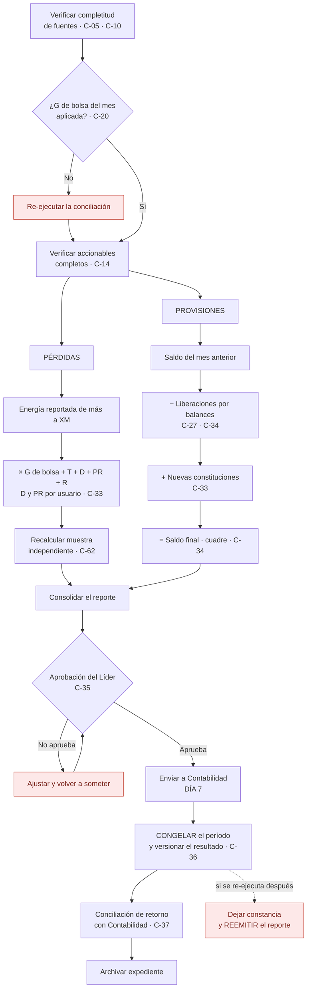

# PR-LIQ-06 · Reporte de Cierre de Mes — Pérdidas y Provisiones

| | |
|---|---|
| **Código** | PR-LIQ-06 |
| **Versión** | 1.0 |
| **Fecha de emisión** | 2026-08-31 |
| **Macroproceso** | Gestión Financiera › Liquidaciones |
| **Proceso** | Reporte mensual de pérdidas y provisiones a Contabilidad |
| **Criticidad** | **Crítica** — su salida afecta directamente los estados financieros |
| **Plazo** | **Día 7 de cada mes, improrrogable** |
| **Elaboró** | Área de Liquidaciones |
| **Revisó** | Líder de Liquidaciones |
| **Aprobó** | Vicepresidencia Financiera |
| **Frecuencia de revisión** | Semestral |
| **Estado** | Borrador para aprobación |

---

## 1. Objetivo

Reportar a Contabilidad, **el día 7 de cada mes**, la posición de **pérdidas** y el **movimiento
de provisiones** del mes de cierre, de forma completa, exacta, oportuna y **reproducible**.

> **Ejemplo canónico:** el **7 de agosto** se envía el reporte del **cierre de julio**, que
> corresponde a **consumos de junio**. La pérdida se origina en la energía reportada de más a XM
> en junio, contrastada con lo que el operador cobra en julio por consumos de junio.

## 2. Alcance

**Incluye:** cálculo y valorización de la pérdida del período, armado del movimiento de
provisiones —saldo inicial, liberaciones por balances, nuevas constituciones y saldo final—,
aprobación, envío a Contabilidad, congelamiento del período y conciliación de retorno.

**No incluye:** la determinación de las diferencias (ver
[PR-LIQ-02](./PR-LIQ-02-preliquidacion-sdl.md)), la validación de balances (ver
[PR-LIQ-04](./PR-LIQ-04-balances-de-energia.md)), el reporte de compensaciones (ver
[PR-LIQ-07](./PR-LIQ-07-reporte-tc2.md)) ni el registro contable.

## 3. Definiciones

| Término | Definición |
|---|---|
| **Mes de cierre** | Mes contable que se reporta. Corresponde a consumos del mes anterior. |
| **Pérdida** | Valor irrecuperable originado en energía reportada a XM por encima de la facturada. Se valoriza con **G de bolsa**. |
| **Provisión** | Valor por causar originado en energía facturada por encima de la reportada a XM. Se valoriza con **G de facturación**. |
| **Liberación** | Consumo de una provisión por el balance de energía del operador. |
| **Movimiento de provisiones** | Saldo inicial + constituciones − liberaciones = saldo final. |
| **Congelamiento del período** | Cierre formal que impide que las cifras reportadas cambien sin dejar constancia. |
| **Conciliación de retorno** | Cruce entre lo reportado por el área y lo registrado por Contabilidad. |

## 4. Documentos de referencia

- [Manual del Área de Liquidaciones](../01-manual-liquidaciones.md) — §8 reglas de valorización, política P-06
- [PR-LIQ-02](./PR-LIQ-02-preliquidacion-sdl.md) y [PR-LIQ-04](./PR-LIQ-04-balances-de-energia.md)
- [Riesgos de fraude](../05-riesgos-de-fraude.md) — F-05
- Política contable de provisiones de la compañía

## 5. Responsabilidades

| Rol | R | A | C | I | Responsabilidad específica |
|---|:-:|:-:|:-:|:-:|---|
| **Analista de Liquidaciones** | ✔ | | | | Verifica la valorización, arma el reporte y el movimiento de provisiones |
| **Líder de Liquidaciones** | | ✔ | | | **Aprueba el reporte antes del envío** y ordena el congelamiento del período |
| **Contabilidad** | | | ✔ | | Registra y ejecuta la conciliación de retorno |
| **TI / Producto** | | | | ✔ | Responsable de que el resultado sea reproducible y versionado |

> **Regla de segregación:** quien arma el reporte **no lo aprueba**. La aprobación del Líder es
> condición del envío, no una formalidad posterior.

## 6. Entradas y salidas

| Entradas | Origen | Oportunidad |
|---|---|---|
| Resultados de conciliación SDL del período | [PR-LIQ-02](./PR-LIQ-02-preliquidacion-sdl.md) | Antes del día 7 |
| G de bolsa del mes de consumo | Metabase | Antes de valorizar |
| Tarifas de transmisión y restricciones del mes | Facturación | Antes de valorizar |
| Tarifas de distribución y pérdidas por usuario | Facturación | Antes de valorizar |
| Saldo de provisiones del mes anterior | Reporte anterior | Al armar el movimiento |
| Balances cruzados en el mes | [PR-LIQ-04](./PR-LIQ-04-balances-de-energia.md) | Al armar el movimiento |

| Salidas | Destino | Oportunidad |
|---|---|---|
| Reporte de pérdidas del período | Contabilidad | **Día 7** |
| Movimiento de provisiones | Contabilidad | **Día 7** |
| Constancia de aprobación | Expediente del período | Antes del envío |
| Período congelado y versionado | Módulo | Tras el envío |
| Conciliación de retorno | Expediente del período | Dentro del mes |

## 7. Condiciones generales

1. **Pérdida y provisión comparten fórmula; solo cambia la generación.** La pérdida usa **G de
   bolsa** y la provisión **G de facturación**. Transmisión y restricciones son iguales para todas
   las fronteras del mes; distribución y pérdidas son **tarifas por usuario**.
2. **La conciliación debe haberse ejecutado con la G de bolsa del mes.** Si corrió antes de que
   estuviera disponible, el valor persistido es el del mecanismo alterno: **hay que re-ejecutar
   antes de reportar**.
3. **El reporte se aprueba antes de enviarse**, y la aprobación queda documentada.
4. **Emitido el reporte, el período se congela.** Cualquier re-ejecución posterior que cambie las
   cifras obliga a **reemitir el reporte** e informar a Contabilidad. *(Política P-06)*
5. **El reporte debe ser reproducible:** debe poder demostrarse, después del hecho, que la cifra
   enviada es la que el sistema tenía el día 7.
6. **El movimiento de provisiones debe cuadrar aritméticamente** y cada liberación debe estar
   soportada por un balance validado en [PR-LIQ-04](./PR-LIQ-04-balances-de-energia.md).

## 8. Descripción del procedimiento

### 8.1 Verificaciones previas

| # | Actividad | Responsable | Sistema | Registro / evidencia | Control |
|:-:|---|---|---|---|:-:|
| 1 | **Verificar la completitud de las fuentes** con que se ejecutó la conciliación del período: fronteras incompletas y operadores faltantes | Analista | Módulo | Panel de estado y detalle de incompletas | **C-05, C-10** |
| 2 | **Verificar que la G de bolsa aplicada es la publicada** para el mes de consumo | Analista | Módulo / Metabase | Valor de G en el panel | **C-20** |
| 3 | Si la conciliación corrió sin la G del mes, **re-ejecutarla** y validar que los valores de pérdida cambiaron en consecuencia | Analista | Módulo | Resultado re-ejecutado | **C-20** |
| 4 | **Verificar que toda frontera con diferencia tiene accionable** registrado | Analista | Módulo | Panel de gestiones | **C-14** |

### 8.2 Pérdidas

| # | Actividad | Responsable | Sistema | Registro / evidencia | Control |
|:-:|---|---|---|---|:-:|
| 5 | **Extraer la energía de diferencia** por mayor reporte a XM del período, por frontera | Analista | Módulo | Exportación del período | C-18 |
| 6 | **Verificar la valorización**: `Δ energía × (G de bolsa + T + D + PR + R)`, con distribución y pérdidas por usuario | Analista | Módulo | Detalle valorizado | **C-33** |
| 7 | **Recalcular una muestra** de fronteras de forma independiente y contrastarla contra el sistema | Analista | Hoja de verificación | Muestra recalculada | **C-62** |
| 8 | **Consolidar el valor total de pérdida** del período y su desagregación por operador y por frontera | Analista | Reporte | Reporte de pérdidas | C-33 |

### 8.3 Provisiones

| # | Actividad | Responsable | Sistema | Registro / evidencia | Control |
|:-:|---|---|---|---|:-:|
| 9 | **Tomar el saldo de provisiones del mes anterior** del reporte previo | Analista | Reporte anterior | Saldo inicial | **C-34** |
| 10 | **Restar las liberaciones**: balances cruzados en el mes, cada uno soportado por su validación | Analista | [PR-LIQ-04](./PR-LIQ-04-balances-de-energia.md) | Anexo de balances cruzados | **C-34, C-27** |
| 11 | **Sumar las nuevas constituciones** del período, valorizadas con las tarifas de la facturación al usuario | Analista | Módulo | Detalle de provisiones | **C-33** |
| 12 | **Cuadrar el movimiento**: saldo inicial + constituciones − liberaciones = saldo final | Analista | Reporte | Movimiento de provisiones | **C-34** |
| 13 | **Explicar las variaciones relevantes** frente al mes anterior y frente al mismo mes del año previo | Analista | Reporte | Notas del reporte | C-34 |

### 8.4 Aprobación, envío y cierre

| # | Actividad | Responsable | Sistema | Registro / evidencia | Control |
|:-:|---|---|---|---|:-:|
| 14 | **Someter el reporte a aprobación del Líder**, con las verificaciones previas y la muestra recalculada como anexo | Líder | Correo | **Aprobación documentada** | **C-35** *(por implementar)* |
| 15 | **Enviar el reporte a Contabilidad** el día 7, conservando la versión exacta enviada | Analista | Correo | Reporte enviado y archivado | C-35 |
| 16 | **Congelar el período** y dejar constancia de la versión del resultado que sustenta el reporte | Líder / Sistema | Módulo | Estado del período | **C-36** *(por implementar)* |
| 17 | **Registrar cualquier re-ejecución posterior** del período y, si cambia las cifras, **reemitir el reporte** informando a Contabilidad | Analista | Módulo + correo | Constancia y reemisión | **C-36** |
| 18 | **Ejecutar la conciliación de retorno** con Contabilidad: lo reportado contra lo registrado, con explicación de toda diferencia | Contabilidad | Cruce documentado | Conciliación firmada | **C-37** *(por implementar)* |
| 19 | **Archivar** el reporte aprobado, sus anexos, la aprobación y la conciliación de retorno | Analista | Carpeta controlada | Expediente del período | C-35 |

## 9. Diagrama de flujo

## 10. Puntos de control del procedimiento

| ID | Control | Objetivo | Naturaleza | Frecuencia | Responsable | Evidencia | Aserción | Prueba de auditoría | Estado |
|---|---|---|---|---|---|---|---|---|---|
| **C-05 / C-10** | Verificación de completitud de fuentes y de fronteras incompletas antes de reportar | Detectivo | Automático | Mensual | Analista | Panel del período | Integridad | Confirmar completitud del período reportado | 🟢 Opera |
| **C-20** | G de bolsa del mes aplicada; re-ejecución si la conciliación corrió sin ella | Preventivo | Híbrido | Mensual | Analista | Valor de G y fecha de ejecución | Valuación | Contrastar la G usada contra la publicada del mes | 🟡 Fallback silencioso |
| **C-33** | Valorización con la estructura tarifaria correcta según pérdida o provisión | Preventivo | Automático | Mensual | Sistema | Detalle valorizado | Valuación | Recalcular 10 fronteras | 🟢 Opera |
| **C-62** | Recálculo independiente de una muestra antes de reportar | Detectivo | Manual | Mensual | Analista | Hoja de verificación | Exactitud | Revisar la muestra del trimestre | 🔴 Por formalizar |
| **C-34** | Cuadre del movimiento de provisiones con soporte de cada liberación | Detectivo | Manual | Mensual | Analista | Movimiento de provisiones | Integridad | Recomponer el movimiento del trimestre | 🟡 Manual en hoja de cálculo |
| **C-27** | Cada liberación soportada por un balance validado | Detectivo | Automático | Mensual | Sistema | Registro del cruce | Existencia | Trazar 5 liberaciones hasta su balance | 🔴 Modelado, no operado |
| **C-35** | Aprobación documentada del Líder antes del envío | Preventivo | Manual | Mensual | Líder | Correo de aprobación | Autorización | Verificar la aprobación de los 3 últimos reportes | 🔴 **Por implementar** |
| **C-36** | Congelamiento del período y versionado del resultado; alerta ante re-ejecución posterior | Preventivo | Automático | Mensual | Sistema | Estado del período | Corte · Existencia | Intentar re-ejecutar un período reportado | 🔴 **No existe** |
| **C-37** | Conciliación de retorno con Contabilidad | Detectivo | Manual | Mensual | Contabilidad | Cruce documentado | Integridad | Revisar la conciliación del trimestre | 🔴 **Por implementar** |

## 11. Riesgos del procedimiento

| ID | Riesgo | Nivel | Control mitigante |
|---|---|---|---|
| **R-20** | Pérdidas o provisiones mal reportadas a Contabilidad | Alto | C-33, C-34, C-62, C-35, C-37 |
| **R-21** | **La cifra reportada no es reproducible después** | Crítico | C-36 — **no existe** |
| **R-08** | Valorización errada por G de bolsa | Alto | C-20 |
| **R-10** | Movimiento de provisiones sin soporte por cruce no sistematizado | Crítico | C-27, C-34 |
| **R-03** | Reportar sobre un período con fuentes incompletas | Crítico | C-05, C-10 |
| **F-05** | **Manipulación de la cifra reportada**: reporte distinto del sistema, re-ejecución posterior u omisión de la re-ejecución con la G correcta | Alto | C-35, C-36, C-37 — **los tres por implementar** |

## 12. Indicadores del procedimiento

| Indicador | Fórmula | Meta | Frecuencia |
|---|---|---|---|
| Oportunidad del reporte | Reportes enviados el día 7 o antes / total | 100 % | Mensual |
| Reportes con aprobación previa documentada | Aprobados antes del envío / total | 100 % | Mensual |
| Re-ejecuciones posteriores al reporte | Cantidad | Cero sin reemisión | Mensual |
| Diferencias en la conciliación de retorno | Valor no explicado / valor reportado | Cero | Mensual |
| Completitud del período reportado | Fuentes cargadas / esperadas | 100 % | Mensual |
| Desviación de la muestra recalculada | Diferencia entre el recálculo y el sistema | Cero | Mensual |

## 13. Registros y retención

| Registro | Soporte | Retención | Responsable |
|---|---|---|---|
| Reporte de pérdidas y movimiento de provisiones | Archivo enviado + carpeta controlada | 5 años | Analista |
| Anexo de balances cruzados | Carpeta controlada | 5 años | Analista |
| Hoja de verificación de la muestra | Carpeta controlada | 5 años | Analista |
| **Aprobación del Líder** | Correo | 5 años | Líder |
| Resultado de conciliación que sustenta el reporte | Base de datos, versionado | Permanente | Sistema |
| Constancia de congelamiento del período | Base de datos | Permanente | Sistema |
| Conciliación de retorno con Contabilidad | Carpeta controlada | 5 años | Contabilidad |

## 14. Contingencias

| Situación | Acción |
|---|---|
| **La G de bolsa del mes no está publicada al día 7** | Reportar con la mejor información disponible **declarando explícitamente la limitación**, y reemitir apenas se publique. No se envía sin advertirlo. |
| **Un operador no envió su preliquidación y el período está incompleto** | Reportar informando qué operadores faltan y qué porcentaje del universo representan. **La incompletitud se declara**, no se omite. |
| **Se detecta un error después de enviado el reporte** | Informar de inmediato a Contabilidad, reemitir con la corrección identificada como nueva versión y dejar constancia del motivo. **No se corrige silenciosamente.** |
| **Se re-ejecuta la conciliación de un período ya reportado** | Registrar quién, cuándo y por qué. Si las cifras cambian, reemitir el reporte. |
| **El movimiento de provisiones no cuadra** | **No se envía.** Se identifica la partida faltante —liberación sin soporte o constitución no registrada— antes de reportar. |
| **Contabilidad registra un valor distinto del reportado** | Documentar la diferencia en la conciliación de retorno, identificar la causa y corregir en la fuente que corresponda. |

## 15. Control de cambios

| Versión | Fecha | Cambio | Autor |
|---|---|---|---|
| 1.0 | 2026-08-31 | Emisión inicial. Incorpora la aprobación previa, el congelamiento del período y la conciliación de retorno como controles obligatorios. | Área de Liquidaciones |
