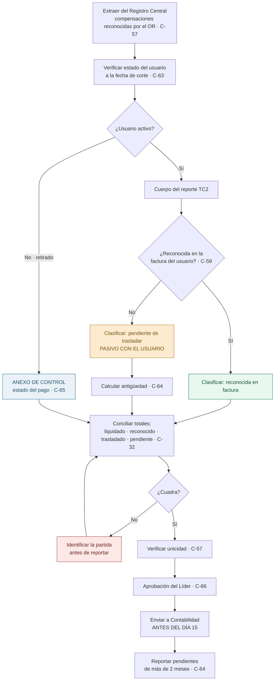

# PR-LIQ-07 · Reporte TC2 de Compensaciones a Contabilidad

| | |
|---|---|
| **Código** | PR-LIQ-07 |
| **Versión** | 1.0 |
| **Fecha de emisión** | 2026-08-31 |
| **Macroproceso** | Gestión Financiera › Liquidaciones |
| **Proceso** | Reporte mensual TC2 de compensaciones a Contabilidad |
| **Criticidad** | **Alta** — es la única conciliación entre lo que el operador reconoció y lo que llegó al usuario |
| **Plazo** | **Antes del día 15 de cada mes** |
| **Elaboró** | Área de Liquidaciones |
| **Revisó** | Líder de Liquidaciones |
| **Aprobó** | Vicepresidencia Financiera |
| **Frecuencia de revisión** | Semestral |
| **Estado** | Borrador para aprobación |

---

## 1. Objetivo

Reportar a Contabilidad, **antes del día 15 de cada mes**, las compensaciones **reconocidas en la
factura del usuario** y las que **el Operador de Red ya reconoció y están pendientes de
trasladar**, de modo que el pasivo con el usuario quede registrado y su antigüedad, controlada.

## 2. Alcance

**Incluye:** la consolidación, clasificación y reporte de las compensaciones del período para
**usuarios activos**, y —como anexo de control— la relación de compensaciones de **usuarios
retirados**.

**Alcance contable explícito:** el reporte TC2 comprende **únicamente usuarios activos**. Los
retirados no forman parte del reporte, pero **sí del anexo de control**, por las razones de §7.4.

**No incluye:** la liquidación ni el pago de las compensaciones (ver
[PR-LIQ-05](./PR-LIQ-05-compensaciones.md)) ni el registro contable.

## 3. Definiciones

| Término | Definición |
|---|---|
| **TC2** | Reporte mensual de compensaciones que el área entrega a Contabilidad. |
| **Reconocida en factura** | Compensación ya trasladada al usuario activo en su factura. |
| **Pendiente de trasladar** | Compensación reconocida por el operador y aún no entregada al usuario. **Es un pasivo con el usuario.** |
| **Anexo de control de retirados** | Relación de las compensaciones de usuarios retirados, con su estado de pago. No forma parte del reporte contable. |
| **Registro Central de Compensaciones** | Fuente única del reporte, definida en [PR-LIQ-05](./PR-LIQ-05-compensaciones.md) §9. |

## 4. Documentos de referencia

- [PR-LIQ-05](./PR-LIQ-05-compensaciones.md) — origen del dato reportado
- [Matriz de riesgos y controles](../04-matriz-de-control.md)
- [Riesgos de fraude](../05-riesgos-de-fraude.md) — F-04
- Política contable de pasivos con clientes

## 5. Responsabilidades

| Rol | R | A | C | I | Responsabilidad específica |
|---|:-:|:-:|:-:|:-:|---|
| **Analista de Liquidaciones** | ✔ | | | | Consolida el reporte desde el Registro Central, concilia y lo somete a aprobación |
| **Líder de Liquidaciones** | | ✔ | | | Aprueba el reporte y su anexo antes del envío |
| **Contabilidad** | | | ✔ | | Registra el pasivo y retroalimenta diferencias |
| **Facturación (bills)** | | | ✔ | | Confirma el estado activo o retirado del usuario y la aplicación en factura |
| **Tesorería** | | | ✔ | | Aporta el estado de los pagos a usuarios retirados para el anexo |

## 6. Entradas y salidas

| Entradas | Origen | Oportunidad |
|---|---|---|
| Registro Central de Compensaciones | [PR-LIQ-05](./PR-LIQ-05-compensaciones.md) | Al consolidar |
| Compensaciones reconocidas por el OR en la factura SDL | [PR-LIQ-05](./PR-LIQ-05-compensaciones.md) | Al consolidar |
| Estado activo o retirado de cada usuario | Facturación | Al consolidar |
| Compensaciones aplicadas en la factura del usuario | Facturación | Al consolidar |
| Estado de los pagos a retirados | Tesorería | Al consolidar el anexo |

| Salidas | Destino | Oportunidad |
|---|---|---|
| Reporte TC2 (usuarios activos) | Contabilidad | **Antes del día 15** |
| Anexo de control de retirados | Contabilidad / Líder | **Antes del día 15** |
| Relación de pendientes por antigüedad | Líder | Mensual |
| Constancia de aprobación | Expediente del período | Antes del envío |

## 7. Condiciones generales

1. **La fuente única del reporte es el Registro Central de Compensaciones.** No se construye desde
   archivos sueltos ni desde el correo.
2. **Solo se reportan compensaciones reconocidas por el operador.** Una compensación liquidada y
   aún no reconocida **no entra** al TC2: se controla en [PR-LIQ-05](./PR-LIQ-05-compensaciones.md).
3. **Cada compensación aparece una sola vez y en un solo estado:** reconocida en factura o
   pendiente de trasladar. Nunca en ambos.
4. **El anexo de retirados es obligatorio.** Aunque contablemente el TC2 cubra solo activos, el
   tramo de mayor riesgo del proceso de compensaciones es el pago a retirados; excluirlo de todo
   reporte lo deja **sin ningún control de salida**. El anexo cierra esa brecha sin alterar el
   alcance contable del TC2.
5. **Las compensaciones pendientes se reportan con su antigüedad.** Ninguna debería superar dos
   meses desde el reconocimiento del operador.
6. **El reporte se aprueba antes de enviarse** y la aprobación queda documentada.

## 8. Descripción del procedimiento

| # | Actividad | Responsable | Sistema | Registro / evidencia | Control |
|:-:|---|---|---|---|:-:|
| 1 | **Extraer del Registro Central** todas las compensaciones **reconocidas por el operador** hasta el corte del período | Analista | Registro Central | Extracción del período | **C-57** |
| 2 | **Verificar el estado de cada usuario** —activo o retirado— a la fecha de corte, contra la información de Facturación | Analista | Facturación | Consulta documentada | **C-63** |
| 3 | **Separar activos y retirados.** Los retirados salen del cuerpo del reporte y pasan al **anexo de control** | Analista | Hoja del reporte | Reporte y anexo | **C-63** |
| 4 | **Clasificar las compensaciones de usuarios activos** en *reconocidas en factura* y *pendientes de trasladar*, verificando cada una contra la factura emitida | Analista | Facturación | Referencia de factura por línea | **C-32, C-59** |
| 5 | **Calcular la antigüedad** de cada compensación pendiente, desde la fecha de reconocimiento del operador | Analista | Hoja del reporte | Columna de antigüedad | **C-64** |
| 6 | **Conciliar los totales**: liquidado, reconocido por el operador, trasladado y pendiente. La diferencia debe ser cero o estar explicada | Analista | Hoja del reporte | Cuadre documentado | **C-32** |
| 7 | **Verificar la unicidad**: que ninguna compensación aparezca dos veces ni en dos estados | Analista | Registro Central | Verificación documentada | **C-57** |
| 8 | **Completar el anexo de retirados** con el estado del pago aportado por Tesorería: pagada, pendiente de certificación bancaria o pendiente de contacto | Analista | Tesorería / Registro Central | Anexo del reporte | **C-65** |
| 9 | **Someter reporte y anexo a aprobación del Líder** | Líder | Correo | Aprobación documentada | **C-66** |
| 10 | **Enviar a Contabilidad** antes del día 15, conservando la versión exacta enviada | Analista | Correo | Reporte enviado y archivado | C-66 |
| 11 | **Reportar al Líder las compensaciones pendientes** con más de dos meses de antigüedad, con la causa de cada una | Analista | Informe del área | Relación de pendientes | **C-64** |
| 12 | **Atender la retroalimentación de Contabilidad** y explicar toda diferencia frente a su registro | Analista | Correo | Cruce documentado | C-32 |
| 13 | **Archivar** reporte, anexo, cuadre, aprobación y soportes | Analista | Carpeta controlada | Expediente del período | C-66 |

## 9. Diagrama de flujo

## 10. Puntos de control del procedimiento

| ID | Control | Objetivo | Naturaleza | Frecuencia | Responsable | Evidencia | Aserción | Prueba de auditoría | Estado |
|---|---|---|---|---|---|---|---|---|---|
| **C-57** | Fuente única: el Registro Central, con verificación de unicidad | Preventivo | Manual | Mensual | Analista | Extracción y verificación | Integridad | Buscar duplicados por usuario y período | 🔴 Depende del registro, **por implementar** |
| **C-63** | Verificación del estado activo o retirado a la fecha de corte | Preventivo | Manual | Mensual | Analista | Consulta a Facturación | Existencia | Verificar el estado de 10 usuarios del reporte | 🔴 Por formalizar |
| **C-32** | Conciliación de totales: liquidado, reconocido, trasladado y pendiente | Detectivo | Manual | Mensual | Analista | Cuadre documentado | Integridad | Recomponer el cuadre del trimestre | 🟡 **Parcial: hoy excluye retirados** |
| **C-59** | Verificación de la aplicación en la factura del usuario, línea por línea | Detectivo | Manual | Mensual | Analista | Referencia de factura | Existencia | Trazar 10 líneas hasta la factura | 🔴 Por formalizar |
| **C-64** | Cálculo y reporte de la antigüedad de las compensaciones pendientes | Detectivo | Manual | Mensual | Analista | Columna de antigüedad | Valuación | Revisar las partidas de más de 2 meses | 🔴 Por formalizar |
| **C-65** | Anexo de control con usuarios retirados y estado de su pago | Detectivo | Manual | Mensual | Analista | Anexo del reporte | Integridad | Verificar que el anexo existe y cuadra con Tesorería | 🔴 **Por implementar** |
| **C-66** | Aprobación del Líder antes del envío | Preventivo | Manual | Mensual | Líder | Correo de aprobación | Autorización | Verificar la aprobación de los 3 últimos reportes | 🔴 Por formalizar |

## 11. Riesgos del procedimiento

| ID | Riesgo | Nivel | Control mitigante |
|---|---|---|---|
| **R-22** | Pasivo con el usuario no registrado o subestimado | Medio | C-32, C-64 |
| **R-17** | Compensación reconocida por el OR que nunca llega al usuario | Alto | C-32, C-59, C-64 |
| **R-18** | Doble compensación —en factura y por pago— no detectada | Medio | C-57 — requiere el registro único |
| **F-04** | **El tramo de pago a retirados queda fuera de todo reporte de control** | **Crítico** | C-65 — **el anexo es la medida que cierra esta brecha** |
| **F-06** | Compensación ficticia incluida en el reporte | Medio | C-57, C-32 |

## 12. Indicadores del procedimiento

| Indicador | Fórmula | Meta | Frecuencia |
|---|---|---|---|
| Oportunidad del reporte | Reportes enviados antes del día 15 / total | 100 % | Mensual |
| Cuadre de la conciliación | Diferencia no explicada / total reconocido | Cero | Mensual |
| Compensaciones pendientes de traslado | Valor pendiente / valor reconocido | ≤ 10 % | Mensual |
| Antigüedad de pendientes | Pendientes con más de 2 meses | Cero | Mensual |
| Cobertura del anexo de retirados | Retirados reportados / retirados con compensación reconocida | 100 % | Mensual |
| Reportes con aprobación previa | Aprobados antes del envío / total | 100 % | Mensual |

## 13. Registros y retención

| Registro | Soporte | Retención | Responsable |
|---|---|---|---|
| Reporte TC2 enviado | Archivo + correo | 5 años | Analista |
| **Anexo de control de retirados** | Archivo controlado | 5 años | Analista |
| Cuadre de conciliación | Carpeta controlada | 5 años | Analista |
| Aprobación del Líder | Correo | 5 años | Líder |
| Retroalimentación de Contabilidad | Correo | 5 años | Analista |
| Extracción del Registro Central | Carpeta controlada | 5 años | Analista |

## 14. Contingencias

| Situación | Acción |
|---|---|
| **No se dispone del estado activo o retirado de un usuario** | No se clasifica por suposición. Se solicita formalmente a Facturación y, si no llega a tiempo, se reporta en una categoría *por confirmar* declarada explícitamente. |
| **El cuadre no da cero** | **No se envía.** Se identifica la partida faltante —una compensación liquidada sin reconocer, un traslado sin registro o un duplicado— antes de reportar. |
| **Una compensación aparece en dos estados** | Se corrige en el Registro Central, se documenta la causa y se verifica que no haya derivado en doble traslado. |
| **Un usuario activo pasa a retirado entre el reconocimiento y el traslado** | Se reclasifica al anexo, se documenta el cambio y se aplica el procedimiento de pago de [PR-LIQ-05](./PR-LIQ-05-compensaciones.md), incluidas titularidad y doble aprobación. |
| **Hay pendientes con más de dos meses** | Se reportan al Líder con la causa de cada una y un plan de cierre. No se dejan correr de un período a otro sin gestión. |
| **Contabilidad registra un valor distinto** | Se documenta la diferencia, se identifica la causa y se corrige en la fuente que corresponda. |

## 15. Control de cambios

| Versión | Fecha | Cambio | Autor |
|---|---|---|---|
| 1.0 | 2026-08-31 | Emisión inicial. Incorpora el anexo de control de usuarios retirados para cerrar la brecha de cobertura del reporte. | Área de Liquidaciones |
