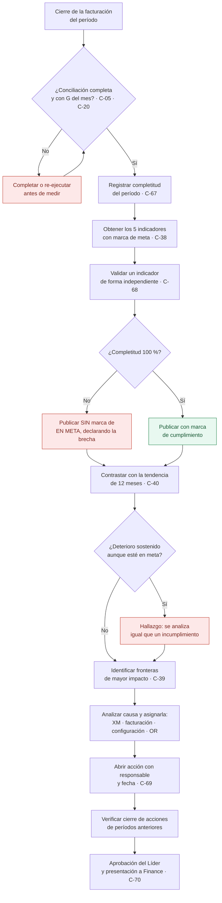

# PR-LIQ-08 · Cierre Post-Facturación e Indicadores

| | |
|---|---|
| **Código** | PR-LIQ-08 |
| **Versión** | 1.0 |
| **Fecha de emisión** | 2026-08-31 |
| **Macroproceso** | Gestión Financiera › Liquidaciones |
| **Proceso** | Cierre post-facturación: medición de desviaciones e indicadores del área |
| **Criticidad** | **Media-Alta** — es la señal de control que el área entrega a la dirección |
| **Plazo** | Posterior al cierre de la facturación del período |
| **Elaboró** | Área de Liquidaciones |
| **Revisó** | Líder de Liquidaciones |
| **Aprobó** | Vicepresidencia Financiera |
| **Frecuencia de revisión** | Semestral, o ante cambio de metas |
| **Estado** | Borrador para aprobación |

---

## 1. Objetivo

Medir las desviaciones entre lo **facturado por BIA** y lo **reportado a XM**, publicar los
indicadores del área contra sus metas, identificar las fronteras de mayor impacto y abrir las
acciones que correspondan con Facturación, Operaciones o el Operador de Red.

## 2. Alcance

**Incluye:** cálculo y validación de los cinco indicadores del período, análisis de tendencia,
identificación de las fronteras de mayor impacto, análisis de causa y presentación a la dirección.

**No incluye:** la conciliación que produce las diferencias (ver
[PR-LIQ-02](./PR-LIQ-02-preliquidacion-sdl.md)) ni el reporte contable (ver
[PR-LIQ-06](./PR-LIQ-06-cierre-de-mes.md)).

## 3. Definiciones

| Término | Definición |
|---|---|
| **Reporte de más a XM** | Energía reportada a XM por encima de la facturada. Origina **pérdida**. |
| **Reporte de menos a XM** | Energía reportada a XM por debajo de la facturada. Origina **provisión**. |
| **Diferencia absoluta** | Suma de ambas desviaciones, sin compensarlas entre sí. Mide la calidad del reporte, no su neto. |
| **Congruencia** | Porcentaje de fronteras en que Facturación, SDL y TC1 coinciden en nivel de tensión y propiedad. |
| **Completitud del período** | Porcentaje de fuentes efectivamente cargadas al momento de calcular el indicador. |
| **Frontera de impacto** | Frontera con mayor valor de pérdida más provisión en el período. |

## 4. Documentos de referencia

- [Manual del Área de Liquidaciones](../01-manual-liquidaciones.md) — política P-10
- [PR-LIQ-02](./PR-LIQ-02-preliquidacion-sdl.md) y [PR-LIQ-01](./PR-LIQ-01-conciliacion-tc1.md) — origen de los datos
- [Riesgos de fraude](../05-riesgos-de-fraude.md) — F-10

## 5. Responsabilidades

| Rol | R | A | C | I | Responsabilidad específica |
|---|:-:|:-:|:-:|:-:|---|
| **Analista de Liquidaciones** | ✔ | | | | Valida los indicadores, analiza causas y prepara la presentación |
| **Líder de Liquidaciones** | | ✔ | | | Aprueba la lectura del período, autoriza el cierre y presenta a Finance |
| **Facturación (bills)** | | | ✔ | | Contraparte cuando la causa está en la facturación |
| **Operaciones / Mercados** | | | ✔ | | Contraparte cuando la causa está en el reporte a XM |
| **Finance** | | | | ✔ | Recibe los indicadores y decide sobre las metas |

## 6. Entradas y salidas

| Entradas | Origen | Oportunidad |
|---|---|---|
| Resultados de conciliación SDL del período | [PR-LIQ-02](./PR-LIQ-02-preliquidacion-sdl.md) | Al cierre |
| Resultados de congruencia | [PR-LIQ-01](./PR-LIQ-01-conciliacion-tc1.md) | Al cierre |
| Energía y valor facturados del período | Facturación | Al cierre |
| Estado de completitud del período | Módulo | Al cierre |

| Salidas | Destino | Oportunidad |
|---|---|---|
| Tablero de indicadores del período con marca de cumplimiento | Finance / dirección | Mensual |
| Relación de fronteras de mayor impacto con análisis de causa | Facturación / Operaciones / OR | Mensual |
| Acciones abiertas con responsable y fecha | Área y contrapartes | Mensual |
| Lectura de tendencia de 12 meses | Finance | Mensual |

## 7. Condiciones generales

1. **Los indicadores se publican junto con la completitud del período.** Un indicador calculado
   sobre un período incompleto **no se declara "en meta"**: las fronteras sin fuente no generan
   pérdida ni provisión y mejoran artificialmente el resultado.
2. **La diferencia absoluta no se compensa.** Reporte de más y de menos se suman; no se netean.
3. **Toda frontera de impacto tiene análisis de causa y responsable.** El indicador no se explica
   solo con su valor.
4. **Las metas no se ajustan para cumplirlas.** Un cambio de meta es decisión de Finance y queda
   documentado. *(Política P-10)*
5. La lectura del período **se contrasta contra la tendencia de 12 meses**: un valor dentro de meta
   con deterioro sostenido es un hallazgo, no un cumplimiento.

## 8. Indicadores del área y sus metas

| Indicador | Fórmula | Meta | Qué señala cuando se rompe |
|---|---|---|---|
| **% Congruencia** | Fronteras congruentes entre las 3 fuentes / total | **> 95 %** | Desalineación de configuración técnica: riesgo de tarifa incorrecta al usuario |
| **% Diferencia por reporte de más a XM** | kWh de pérdida / kWh facturados | **< 0,15 %** | Pérdida irrecuperable: se reportó energía que no se facturó |
| **% Diferencia por reporte de menos a XM** | kWh de provisión / kWh facturados | **< 0,20 %** | Provisión creciente: el operador cobrará después |
| **% Diferencia absoluta en kWh** | (kWh pérdida + kWh provisión) / kWh facturados | **< 0,35 %** | Calidad del reporte de fronteras, con independencia del signo |
| **% Pérdida** | Valor de pérdida / valor facturado | **< 0,10 %** | Impacto económico directo en el margen |

## 9. Descripción del procedimiento

| # | Actividad | Responsable | Sistema | Registro / evidencia | Control |
|:-:|---|---|---|---|:-:|
| 1 | **Verificar que la conciliación del período está completa** y ejecutada con la G de bolsa del mes | Analista | Módulo | Panel del período | **C-05, C-20** |
| 2 | **Registrar la completitud del período**: fuentes cargadas sobre esperadas y fronteras incompletas sobre el universo | Analista | Módulo | Tablero del período | **C-67** |
| 3 | **Obtener los cinco indicadores** del período con su marca de cumplimiento | Analista | Módulo | Tablero de indicadores | **C-38** |
| 4 | **Validar el cálculo** de al menos un indicador de forma independiente, con la exportación del período | Analista | Hoja de verificación | Verificación documentada | **C-68** |
| 5 | **Contrastar contra la tendencia de 12 meses** e identificar deterioros sostenidos, aunque el mes esté en meta | Analista | Módulo | Panel histórico | **C-40** |
| 6 | **Identificar las fronteras de mayor impacto** del período —pérdida más provisión— y su participación en el total | Analista | Módulo | Relación de fronteras | **C-39** |
| 7 | **Analizar la causa de cada frontera de impacto** y asignarla: reporte a XM, facturación, configuración técnica o liquidación del operador | Analista | Hoja de análisis | Análisis documentado | **C-39** |
| 8 | **Abrir la acción con la contraparte** que corresponda, con responsable y fecha de cierre | Analista | Correo / control de acciones | Registro de acciones | **C-69** |
| 9 | **Verificar el cierre de las acciones** abiertas en períodos anteriores y su efecto en el indicador | Analista | Control de acciones | Seguimiento documentado | **C-69** |
| 10 | **Someter la lectura del período a aprobación del Líder**, incluida la declaración de completitud | Líder | Informe del período | Aprobación documentada | **C-70** |
| 11 | **Presentar los indicadores a Finance** con la lectura de tendencia y las acciones en curso | Líder | Comité | Presentación archivada | C-70 |
| 12 | **Archivar** tablero, análisis, acciones y aprobación del período | Analista | Carpeta controlada | Expediente del período | C-70 |

## 10. Diagrama de flujo

## 11. Puntos de control del procedimiento

| ID | Control | Objetivo | Naturaleza | Frecuencia | Responsable | Evidencia | Aserción | Prueba de auditoría | Estado |
|---|---|---|---|---|---|---|---|---|---|
| **C-38** | Cálculo automático de los cinco indicadores contra su meta | Detectivo | Automático | Mensual | Sistema | Tablero | Exactitud | Recalcular un indicador desde la exportación | 🟢 Opera |
| **C-40** | Análisis de tendencia con histórico de 12 meses | Detectivo | Automático | Mensual | Líder | Panel histórico | — | Revisar la serie del último año | 🟢 Opera |
| **C-05 / C-20** | Verificación de completitud y de la G del mes antes de medir | Detectivo | Híbrido | Mensual | Analista | Panel del período | Integridad · Valuación | Confirmar ambas condiciones en el período medido | 🟡 Parcial |
| **C-67** | **Publicación del indicador junto con la completitud del período**; sin completitud total no se declara "en meta" | Preventivo | Manual | Mensual | Analista | Tablero del período | Integridad | Verificar que el tablero declara la completitud | 🔴 **Por implementar — mitiga F-10** |
| **C-68** | Validación independiente del cálculo de al menos un indicador | Detectivo | Manual | Mensual | Analista | Hoja de verificación | Exactitud | Revisar la verificación del trimestre | 🔴 Por formalizar |
| **C-39** | Análisis de causa de las fronteras de mayor impacto | Detectivo | Manual | Mensual | Analista | Análisis documentado | — | Revisar el análisis de 5 fronteras | 🟡 Sin registro estructurado |
| **C-69** | Registro y seguimiento de acciones con responsable y fecha | Detectivo | Manual | Mensual | Analista | Control de acciones | — | Revisar el estado de las acciones abiertas | 🔴 Por formalizar |
| **C-70** | Aprobación del Líder de la lectura del período antes de presentarla | Preventivo | Manual | Mensual | Líder | Aprobación documentada | Autorización | Verificar la aprobación de los 3 últimos períodos | 🔴 Por formalizar |

## 12. Riesgos del procedimiento

| ID | Riesgo | Nivel | Control mitigante |
|---|---|---|---|
| **R-23** | Deterioro sostenido de los indicadores no detectado a tiempo | Medio | C-40, C-39, C-69 |
| **R-24** | **Indicador que mejora por omisión de carga y no por gestión** | Alto | C-67 — **por implementar** |
| **R-08** | Indicador de pérdida calculado con una valorización errada | Alto | C-20 |
| **F-10** | **Ocultamiento de pérdidas por omisión deliberada de carga** | Alto | C-05 + C-67 |
| **R-21** | Indicadores que no coinciden con lo reportado a Contabilidad por re-ejecución posterior | Crítico | C-36 en [PR-LIQ-06](./PR-LIQ-06-cierre-de-mes.md) |

## 13. Indicadores del procedimiento

| Indicador | Fórmula | Meta | Frecuencia |
|---|---|---|---|
| Oportunidad del cierre | Períodos cerrados dentro de la semana siguiente a la facturación / total | 100 % | Mensual |
| Completitud del período medido | Fuentes cargadas / esperadas | 100 % | Mensual |
| Cobertura del análisis de causa | Fronteras de impacto con causa asignada / total analizadas | 100 % | Mensual |
| Cierre de acciones | Acciones cerradas en el plazo / abiertas | ≥ 80 % | Mensual |
| Reincidencia de fronteras de impacto | Fronteras que repiten en el top de impacto / total | Vigilar | Trimestral |

## 14. Registros y retención

| Registro | Soporte | Retención | Responsable |
|---|---|---|---|
| Tablero de indicadores del período | Módulo + archivo del período | 5 años | Analista |
| Hoja de verificación independiente | Carpeta controlada | 5 años | Analista |
| Relación de fronteras de impacto y análisis de causa | Carpeta controlada | 5 años | Analista |
| Control de acciones con responsable y fecha | Carpeta controlada | 5 años | Analista |
| Aprobación del Líder y presentación a Finance | Correo / carpeta | 5 años | Líder |

## 15. Contingencias

| Situación | Acción |
|---|---|
| **El período está incompleto al momento de medir** | Se publica el indicador **con la declaración de completitud** y **sin marca de cumplimiento**. No se presenta como logro un resultado obtenido sobre información parcial. |
| **Un indicador rompe la meta** | Se analiza la causa antes de presentarlo, se identifican las fronteras que la explican y se abre la acción con la contraparte. La presentación incluye el plan, no solo el número. |
| **El indicador está en meta pero la tendencia se deteriora** | Se trata como hallazgo: se analiza y se abre acción igual que en un incumplimiento. |
| **Los indicadores no coinciden con el reporte contable del período** | Verificar si la conciliación se re-ejecutó después del reporte. Si cambió, aplicar la reemisión prevista en [PR-LIQ-06](./PR-LIQ-06-cierre-de-mes.md). |
| **Se propone ajustar una meta** | La decisión es de Finance y se documenta con la justificación técnica. El área **no ajusta metas** para reportar cumplimiento. |

## 16. Control de cambios

| Versión | Fecha | Cambio | Autor |
|---|---|---|---|
| 1.0 | 2026-08-31 | Emisión inicial. Incorpora la completitud como condición para declarar cumplimiento de meta. | Área de Liquidaciones |
