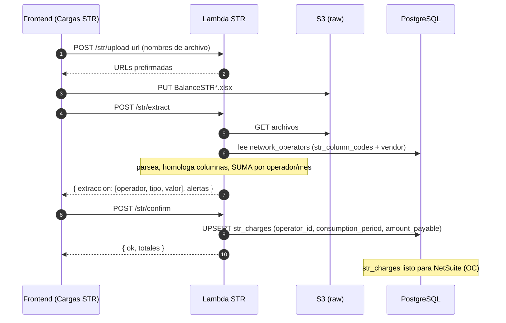

# Arquitectura — Lambda de Cargos STR

Servicio serverless que ingiere los archivos `BalanceSTR*.xlsx` del módulo
**Cargas STR**, extrae la información y deja en la BD el valor a pagar por
operador y periodo. Ese resultado es el que alimenta a NetSuite para crear las
órdenes de compra.

```
Excel BalanceSTR ──▶ extracción (parser) ──▶ str_charges ──▶ NetSuite (OC)
```

> Este documento describe el **flujo** y la **estructura de carpetas**. La
> implementación (infra, IaC, código) queda fuera de alcance — este entregable
> es solo el SQL ([`../sql/`](../sql/)), la documentación y la estructura.

---

## Flujo (preview → confirmar)

Los `BalanceSTR*.xlsx` pueden pesar > 4.5 MB, por encima del límite de payload de
Lambda (6 MB). Por eso el archivo se sube directo a S3 y el Lambda lo lee de ahí.



### Endpoints lógicos (detalle completo en [`PROCESO.md`](./PROCESO.md))

| # | Etapa | Método | Ruta | Qué hace |
|---|---|---|---|---|
| 1 | Cargue | `POST` | `/str/upload-url` | Devuelve URLs prefirmadas de S3 |
| 2 | Extracción | `POST` | `/str/extract` | Lee de S3, parsea, devuelve valores crudos (dry-run) |
| 3 | Procesamiento | `POST` | `/str/confirm` | Suma factura+refactura, UPSERT en `str_charges` |
| 4 | Resultado | `GET` | `/str/cargos` | Devuelve lo guardado (listo para NetSuite) |

---

## Lógica de extracción (portada del parser)

Núcleo: `app_liquidaciones/lib/parsers/insumos-str.ts`. Reglas a preservar:

1. **Tipo por nombre del archivo**:
   - `tipo factu` → hojas `BalSTR01` + `BalSTR02` → suma en `invoice_amount`.
   - `tipo refactu` → hojas `BalSTR01_Ajuste` + `BalSTR02_Ajuste` → suma en `reinvoice_amount`.
2. **Periodo de consumo**: se detecta del nombre del archivo factu
   (`-ene`, `_feb`, …) y se aplica a todo el lote.
3. **Fila de datos**: en la **columna B** (títulos `agentes`) se filtra la fila
   `BIAC-BIAE`; en la fila ~7-8 están los operadores de red con sus valores.
4. **Homologación + suma**: por cada columna cuyo código esté en
   `network_operators.str_column_codes` se toma el valor de la fila BIAC-BIAE y se
   **acumula por operador** (`AIRE = CSID + CSSD`). Incluye negativos.
5. **Total**: `amount_payable = invoice_amount + reinvoice_amount` (lo calcula la BD).
   Es el valor a pagar a cada operador → viaja a NetSuite como orden de compra.

---

## Estructura de carpetas propuesta

> Solo `sql/` y `docs/` están materializados en este entregable; el resto
> documenta cómo se organizaría la implementación.

```
services/liquidations-str-ingest/
├── README.md
├── docs/
│   ├── ARCHITECTURE.md           # este documento
│   └── DATABASE.md               # diagrama ER + tablas
├── sql/                          # ← DDL ejecutable (entregado)
│   ├── 001_tables.sql            # network_operators + str_charges
│   ├── 002_seed_operators.sql   # operadores + códigos de columna
│   └── schema.dbml               # esquema para dbdiagram.io
│
└── src/                          # (fuera de alcance)
    ├── handlers/                 # entrypoints Lambda (uno por etapa/endpoint)
    │   ├── uploadUrl.ts          #   1 · POST /str/upload-url  (cargue)
    │   ├── extract.ts            #   2 · POST /str/extract     (extracción, dry-run)
    │   ├── confirm.ts            #   3 · POST /str/confirm     (procesamiento + UPSERT)
    │   └── cargos.ts             #   4 · GET  /str/cargos      (resultado)
    ├── domain/                   # lógica pura (sin I/O)
    │   ├── parser/insumosStr.ts  #   Excel → [operador, periodo, valor]
    │   └── models/cargoStr.ts
    ├── data/                     # acceso a datos
    │   ├── db.ts
    │   ├── operadoresRepo.ts
    │   └── cargosRepo.ts
    └── infra/
        ├── s3.ts
        └── config.ts
```

Regla: `domain/` es **puro** (parseo, homologación, suma) — no conoce S3 ni la
BD, y es testeable de forma aislada.

---

## Correspondencia con el sistema actual

| App_Liquidaciones (monolito) | Lambda STR |
|---|---|
| `POST /api/cargas/preview` (multipart) | `POST /str/upload-url` + `POST /str/extract` (S3) |
| `POST /api/cargas/confirmar` | `POST /str/confirm` (UPSERT) |
| `lib/parsers/insumos-str.ts` | `src/domain/parser/insumosStr.ts` |
| `HOMOLOGACION` (const en código) | `network_operators.str_column_codes` |
| `registros_str` (deleteMany + reinsert) | `str_charges` (UPSERT por operador/periodo) |

### Cómo se replica el "valor a pagar" ya construido

En App_Liquidaciones el valor a pagar **no** se guarda pre-sumado: cada archivo
emite filas separadas en `registros_str` (factura y refactura, con `tipo` en
`detalle_json`) y el total se calcula al leer:

```
valor a pagar = SUM(registros_str.valor_cop)  GROUP BY (periodo_id, or_id)
```

(ver `app/api/str-por-or/route.ts` y `lib/integrations/netsuite/service.ts` — el
`aggregate _sum` incluye factura + refactura). El monto viaja a NetSuite como
**Decimal → string `toFixed(2)`**, nunca `Number`.

La BD nueva produce **el mismo resultado**, modelado más explícito:

```
str_charges.invoice_amount  (Σ tipo factu)
str_charges.reinvoice_amount(Σ tipo refactu)
str_charges.amount_payable = invoice_amount + reinvoice_amount   (GENERATED)
```

Reglas preservadas de la lógica construida:
- **Precisión**: `NUMERIC(18,2)` (equivale al `Decimal`); a NetSuite `toFixed(2)`.
- **Negativos** válidos (ajustes/refacturas).
- **Sobrescritura por periodo**: el `deleteMany + reinsert` del origen se
  reemplaza por `UPSERT` sobre `UNIQUE(operator_id, consumption_period)`.
- **`mes_consumo`** se detecta del archivo tipo factu y aplica a todo el lote.
- **Homologación** `AIRE = CSID + CSSD` (columnas que suman al mismo operador).

---

## Convención de periodo (trampa heredada)

`consumption_period` es el mes de **CONSUMO** en formato `"AAAA-MM"`. La facturación
= consumo + 1. En NetSuite la OC usa `tranDate = "<consumption_period>-01"`. No
confundir con el CUID de `periodos_conciliacion` del backend de conciliación
(ver `CONTEXTO_MIGRACION.md §2.1`).
