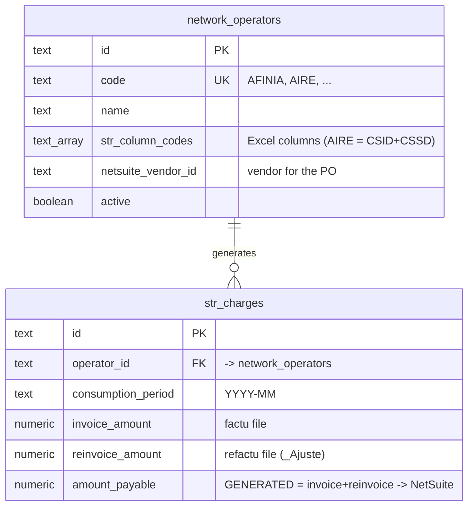

# Base de datos — STR Charges

Modelo relacional (PostgreSQL) mínimo, en el schema **`liquidations_str`** dentro
de la base de datos **BIA-BI**. La carga de los Excel `BalanceSTR*.xlsx` en el
módulo **Cargas STR** extrae la información y la deja en una tabla con
**únicamente**: operador de red, periodo de consumo y el valor exacto a pagar.
Esa tabla es la que luego se envía a **NetSuite** para crear las órdenes de compra.

```
Excel BalanceSTR ──▶ extracción (parser) ──▶ str_charges ──▶ NetSuite (PO)
```

DDL ejecutable en [`../sql/`](../sql/):

| Archivo | Contenido |
|---|---|
| `000_schema.sql` | `CREATE SCHEMA liquidations_str` |
| `001_tables.sql` | Tablas `network_operators` y `str_charges` + relación |
| `002_seed_operators.sql` | Operadores STR + sus códigos de columna del Excel |
| `schema.dbml` | Mismo esquema en DBML para dbdiagram.io |

---

## Diagrama Entidad-Relación



---

## Tablas

### `str_charges` — lo que se debe pagar (destino de la carga → NetSuite)
El resultado de la extracción. Una fila por **(operador, periodo de consumo)**,
con el desglose de los dos tipos de archivo.

| Columna | Tipo | Notas |
|---|---|---|
| `id` | text PK | uuid |
| `operator_id` | text FK → `network_operators` | operador de red |
| `consumption_period` | text | `"YYYY-MM"` (mes de consumo) |
| `invoice_amount` | numeric(18,2) | suma del archivo **tipo factu** (hojas `BalSTR01` + `BalSTR02`) |
| `reinvoice_amount` | numeric(18,2) | suma del archivo **tipo refactu** (hojas `BalSTR01_Ajuste` + `BalSTR02_Ajuste`) |
| `amount_payable` | numeric(18,2) | **GENERATED** = `invoice_amount + reinvoice_amount`; lo que viaja a NetSuite |
| `created_at` / `updated_at` | timestamptz | |

`amount_payable` es una **columna generada** (`GENERATED ALWAYS AS ... STORED`):
la BD la calcula sola, nunca se desincroniza del desglose. La extracción solo
escribe `invoice_amount` y `reinvoice_amount` (ambos default 0 si el operador
aparece en un solo tipo). Los valores pueden ser negativos (ajustes).

**`UNIQUE(operator_id, consumption_period)`** — un único registro por operador y
periodo. Re-cargar el mismo periodo hace **UPSERT** (sobrescribe invoice/reinvoice).

Para la orden de compra en NetSuite: `entity` = `network_operators.netsuite_vendor_id`,
`tranDate` = `consumption_period-01`, `rate` = `amount_payable`.

### `network_operators` — catálogo de operadores
Provee dos cosas al proceso:
- **`str_column_codes`** (text[]): los códigos de columna del `BalanceSTR` que
  pertenecen al operador. La extracción suma esas columnas. Ej.: `AIRE = {CSID, CSSD}`.
  (Antes era el diccionario `HOMOLOGACION` hardcodeado en el parser — es apoyo de
  la **extracción**, no viaja a NetSuite.)
- **`netsuite_vendor_id`**: internalId del proveedor para crear la OC.

Otras columnas: `code` (identificador estable del negocio: `AFINIA`, `AIRE`…),
`name` (etiqueta para mostrar), `active` (soft-delete: apagar sin borrar).

---

## Por qué solo estas 2 tablas

- **`str_charges`** es el único dato que persiste y viaja a NetSuite → se mantiene
  al mínimo (operador + periodo + valores). Guarda el desglose factura/refactura
  para trazabilidad, con el total calculado por la BD.
- **`network_operators`** es un catálogo necesario para (a) mapear las columnas
  del Excel al operador durante la extracción y (b) resolver el proveedor de la OC.
- El detalle del archivo, tipos FACTURA/REFACTURA, staging, etc. son parte del
  **proceso de extracción** (en el Lambda), no del modelo de datos.
- El seguimiento del envío a NetSuite (número de OC, estado) es una preocupación
  aparte; si se necesita, se agrega la tabla opcional `str_netsuite_submissions`
  (esbozada al pie de `001_tables.sql`) sin tocar `str_charges`.
