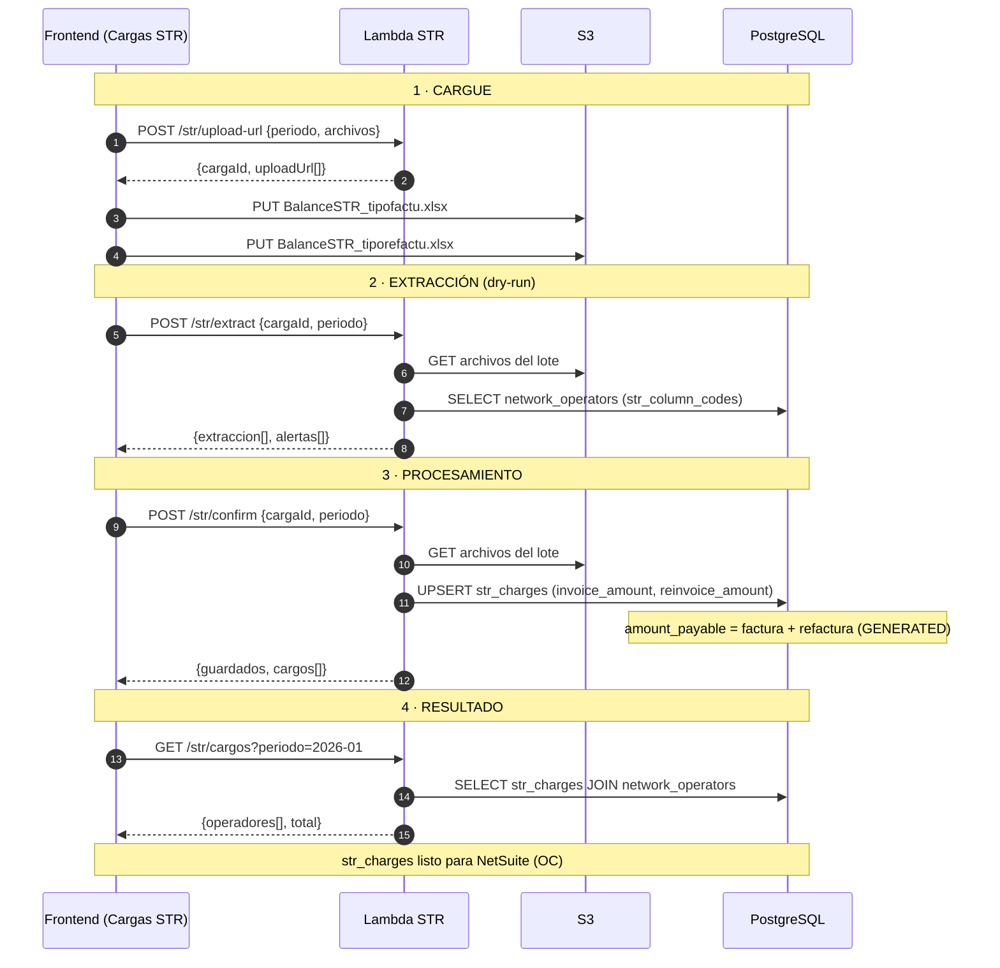

# Proceso end-to-end y endpoints — Lambda Cargos STR

Documentación completa del proceso, desde que se sube el archivo hasta que se
muestra el resultado listo para NetSuite. Cada **etapa** del proceso se modela
como un **endpoint independiente** del Lambda.

```
┌──────────┐   ┌─────────────┐   ┌───────────────┐   ┌───────────┐
│ 1. CARGUE│──▶│ 2. EXTRACCIÓN│──▶│ 3.PROCESAMIENTO│──▶│4. RESULTADO│
│  archivo │   │  del Excel   │   │  suma + guarda │   │  mostrar   │
└──────────┘   └─────────────┘   └───────────────┘   └───────────┘
 upload-url        extract           confirm             cargos
   (S3)          (parse, dry)     (UPSERT str_charges)   (GET BD)
```

- **Modelo de datos:** [`DATABASE.md`](./DATABASE.md) (`network_operators`, `str_charges`).
- **Arquitectura y estructura:** [`ARCHITECTURE.md`](./ARCHITECTURE.md).
- Todos los endpoints corren en **runtime `nodejs`** (se necesita `xlsx` para
  leer el Excel) y responden JSON con la forma de error uniforme del §Errores.

---

## Componentes

| Componente | Rol |
|---|---|
| **Frontend** (módulo Cargas STR de olibia-web) | Orquesta las 4 llamadas y sube el archivo a S3 |
| **API Gateway** | Expone las rutas y enruta a los handlers Lambda |
| **Lambda STR** | 4 handlers (uno por etapa) |
| **S3** (`bucket/uploads/{cargaId}/`) | Guarda los `BalanceSTR*.xlsx` crudos |
| **PostgreSQL** | `network_operators` (catálogo) + `str_charges` (resultado) |
| **NetSuite** | Consumidor final de `str_charges` (fuera de este servicio) |

## Resumen de endpoints

| # | Etapa | Método | Ruta | Persiste | Idempotente |
|---|---|---|---|---|---|
| 1 | Cargue | `POST` | `/str/upload-url` | crea lote lógico | sí |
| 2 | Extracción | `POST` | `/str/extract` | no (dry-run) | sí |
| 3 | Procesamiento | `POST` | `/str/confirm` | `str_charges` (UPSERT) | sí |
| 4 | Resultado | `GET` | `/str/cargos` | no (lectura) | sí |

> **Por qué S3 y no el archivo en el body:** los `BalanceSTR*.xlsx` pueden pesar
> > 4.5 MB, por encima del límite de payload síncrono de Lambda (6 MB) y del de
> API Gateway (10 MB). El archivo se sube directo a S3 con URL prefirmada y el
> Lambda lo lee desde ahí por su `cargaId`.

---

## Etapa 1 — Cargue del archivo · `POST /str/upload-url`

Registra un lote de carga y devuelve **URLs prefirmadas** para que el frontend
suba cada `BalanceSTR*.xlsx` directo a S3. No procesa nada todavía.

### Entrada
```jsonc
{
  "periodo": { "anio": 2026, "mes": 2 },   // mes de FACTURACIÓN (contexto del lote)
  "archivos": [
    { "nombre": "BalanceSTR_tipofactu_-ene.xlsx" },
    { "nombre": "BalanceSTR_tiporefactu_-ene.xlsx" }
  ]
}
```

### Proceso interno
1. Validar el body (Zod): `periodo` válido, `archivos` no vacío (1..N).
2. Generar un `cargaId` (uuid) → prefijo S3 `uploads/{cargaId}/`.
3. Por cada archivo, generar una **presigned PUT URL** (expira ~15 min) con su
   `s3Key = uploads/{cargaId}/{nombre}`.
4. (Opcional) registrar el lote en una tabla de trazabilidad. Con el modelo
   mínimo actual **no se persiste**: el `cargaId` viaja al FE y vuelve en las
   etapas 2 y 3.

### Salida `201`
```jsonc
{
  "cargaId": "8f3a…",
  "s3Prefix": "uploads/8f3a…/",
  "expiraEnSeg": 900,
  "archivos": [
    { "nombre": "BalanceSTR_tipofactu_-ene.xlsx",
      "s3Key": "uploads/8f3a…/BalanceSTR_tipofactu_-ene.xlsx",
      "uploadUrl": "https://s3…X-Amz-Signature=…" }
    // …una por archivo
  ]
}
```

### Errores
`400 VALIDATION_ERROR` (body inválido) · `500 INTERNAL_ERROR`.

### Después de esta etapa
El FE hace `PUT` de cada archivo a su `uploadUrl`. Los `.xlsx` quedan en S3 bajo
`uploads/{cargaId}/`. Nada en la BD todavía.

---

## Etapa 2 — Extracción de la información · `POST /str/extract`

Lee los archivos del lote desde S3 y **extrae los valores crudos** por operador
y por tipo (factu / refactu). Es un **dry-run**: no persiste. Sirve para que el
usuario revise antes de confirmar.

### Entrada
```jsonc
{
  "cargaId": "8f3a…",
  "periodo": { "anio": 2026, "mes": 2 }
}
```

### Proceso interno (réplica del parser `insumos-str.ts`)
1. Listar los objetos en `uploads/{cargaId}/` y descargarlos como buffers.
2. **Detectar tipo por nombre**: contiene `tiporefactu` → REFACTURA; contiene
   `tipofactu` → FACTURA; otro → archivo **OMITIDO** (alerta, no error).
3. **Detectar `consumption_period`**: del nombre del archivo tipo factu
   (`-ene`, `_feb`, …). Si el mes detectado > mes del período ⇒ año − 1.
   Formato `"AAAA-MM"`. Se aplica a **todo** el lote (factu y refactu).
4. Por cada archivo, elegir las hojas según el tipo:
   - FACTURA → `BalSTR01`, `BalSTR02`.
   - REFACTURA → `BalSTR01_Ajuste`, `BalSTR02_Ajuste`.
5. En cada hoja: autodetectar la fila header (la que tiene más códigos de
   operador) y, en la **columna B** (títulos `agentes`), ubicar la fila
   **`BIAC-BIAE`** (tolerante a espacios/guiones/mayúsculas).
6. En esa fila (≈ fila 7-8) están los operadores. Por cada columna cuyo código
   (`CMMD`, `CSID`, …) esté en `network_operators.str_column_codes`, tomar el valor y
   **acumular por operador** (suma `BalSTR01 + BalSTR02`; `AIRE = CSID + CSSD`).
   Se conservan negativos.
7. Devolver los valores crudos por operador/tipo (sin sumar factu+refactu aún).

### Salida `200`
```jsonc
{
  "cargaId": "8f3a…",
  "periodoConsumo": "2026-01",
  "extraccion": [
    { "orCodigo": "AIRE", "tipo": "FACTURA",   "valor": 100.00,
      "columnas": ["CSID","CSSD"], "archivo": "BalanceSTR_tipofactu_-ene.xlsx" },
    { "orCodigo": "AIRE", "tipo": "REFACTURA", "valor": -5.00,
      "columnas": ["CSID","CSSD"], "archivo": "BalanceSTR_tiporefactu_-ene.xlsx" }
    // …
  ],
  "alertas": [
    "Mes de consumo del lote: 2026-01 (detectado de \"BalanceSTR_tipofactu_-ene.xlsx\")."
  ],
  "erroresCriticos": []
}
```

### Errores
`400 VALIDATION_ERROR` · `404 CARGA_NO_ENCONTRADA` (no hay objetos en S3) ·
`422 MES_NO_DETECTADO` · `422 SIN_REGISTROS` (ningún BIAC-BIAE / ningún operador
homologado) · `500 INTERNAL_ERROR`.

### Después de esta etapa
El FE muestra la extracción para revisión. Nada en la BD.

---

## Etapa 3 — Procesamiento de datos · `POST /str/confirm`

Toma el lote, **suma factura + refactura** por operador, resuelve el operador y
**persiste** en `str_charges` (UPSERT). Es la etapa autoritativa: vuelve a leer de
S3 por `cargaId` para no confiar en datos del cliente.

### Entrada
```jsonc
{
  "cargaId": "8f3a…",
  "periodo": { "anio": 2026, "mes": 2 },
  "confirmadoPor": "finanzas@bia.app"
}
```

### Proceso interno
1. Repetir la extracción (pasos 1-6 de la Etapa 2) desde S3 → valores por
   operador/tipo.
2. **Consolidar por operador**: para cada `orCodigo`
   - `invoice_amount`  = Σ valores tipo FACTURA
   - `reinvoice_amount`= Σ valores tipo REFACTURA
   (`amount_payable` NO se calcula acá: lo genera la BD.)
3. **Resolver operador**: `orCodigo → network_operators.id`. Si un código no existe
   en el catálogo → se acumula en `erroresCriticos` (o alerta) según política.
4. **UPSERT transaccional** en `str_charges` por `(operator_id, consumption_period)`:
   ```sql
   INSERT INTO str_charges (id, operator_id, consumption_period, invoice_amount, reinvoice_amount)
   VALUES (gen_random_uuid()::text, $orId, $periodo, $factura, $refactura)
   ON CONFLICT (operator_id, consumption_period) DO UPDATE SET
     invoice_amount   = EXCLUDED.invoice_amount,
     reinvoice_amount = EXCLUDED.reinvoice_amount,
     updated_at      = now();
   -- amount_payable (GENERATED) se recalcula solo = invoice_amount + reinvoice_amount
   ```
   > Re-cargar el mismo período **sobrescribe** los valores (reemplaza la lógica
   > `deleteMany + reinsert` del sistema original, sin borrar el histórico de
   > otros períodos).

### Salida `200`
```jsonc
{
  "cargaId": "8f3a…",
  "periodoConsumo": "2026-01",
  "guardados": 22,
  "cargos": [
    { "orCodigo": "AIRE", "orNombre": "Aire",
      "valorFactura": 100.00, "valorRefactura": -5.00, "valorPagar": 95.00 }
    // …un objeto por operador
  ],
  "erroresCriticos": []
}
```

### Errores
`400 VALIDATION_ERROR` · `404 CARGA_NO_ENCONTRADA` · `422 SIN_REGISTROS` ·
`422 OPERADOR_NO_HOMOLOGADO` (código sin match en `network_operators`) ·
`500 INTERNAL_ERROR`.

### Después de esta etapa
`str_charges` tiene el valor a pagar por operador para el `consumption_period`. Listo
para NetSuite.

---

## Etapa 4 — Mostrar el resultado · `GET /str/cargos`

Devuelve lo almacenado en `str_charges` para un período — lo que efectivamente se
va a pagar / enviar a NetSuite. Solo lectura.

### Entrada (query)
```
GET /str/cargos?periodo=2026-01
```

### Proceso interno
```sql
SELECT o.code, o.name, o.netsuite_vendor_id,
       c.invoice_amount, c.reinvoice_amount, c.amount_payable
FROM   str_charges c
JOIN   network_operators o ON o.id = c.operator_id
WHERE  c.consumption_period = $periodo
ORDER  BY o.name;
```

### Salida `200`
```jsonc
{
  "periodoConsumo": "2026-01",
  "operadores": [
    { "orCodigo": "AIRE", "orNombre": "Aire", "netsuiteVendorId": "53301",
      "valorFactura": 100.00, "valorRefactura": -5.00, "valorPagar": 95.00 }
    // …
  ],
  "total": 12345678.90
}
```

> **Precisión:** los montos se transportan/serializan con 2 decimales. Para el
> envío a NetSuite se usan como **string `toFixed(2)`**, nunca `Number` (regla
> heredada del sistema original — evita errores de redondeo en el `amount`).

### Errores
`400 VALIDATION_ERROR` (período mal formado) · `500 INTERNAL_ERROR`.

---

## Diagrama de secuencia completo



---

## Contratos de datos (tipos)

```ts
// Extracción cruda (Etapa 2)
type FilaExtraccion = {
  orCodigo: string
  tipo: "FACTURA" | "REFACTURA"
  valor: number            // negativos permitidos
  columnas: string[]       // códigos de columna que sumaron (ej. ["CSID","CSSD"])
  archivo: string
}

// Cargo consolidado (Etapas 3 y 4)
type Cargo = {
  orCodigo: string
  orNombre: string
  periodoConsumo: string   // "AAAA-MM"
  valorFactura: number
  valorRefactura: number
  valorPagar: number       // = valorFactura + valorRefactura
}
```

---

## Validaciones y códigos de error

Forma uniforme: `{ "error": "CODIGO", "message": "texto", ...campos }`.
Los `500` devuelven `{ "error": "INTERNAL_ERROR", "message": "Error interno" }`
(el detalle va a los logs, nunca al cliente).

| Código | HTTP | Cuándo |
|---|---|---|
| `VALIDATION_ERROR` | 400 | Body/query inválido (Zod). Incluye `issues`. |
| `CARGA_NO_ENCONTRADA` | 404 | No hay objetos en `uploads/{cargaId}/`. |
| `MES_NO_DETECTADO` | 422 | Ningún archivo tiene mes en el nombre. |
| `SIN_REGISTROS` | 422 | No se halló `BIAC-BIAE` o ningún operador homologado. |
| `OPERADOR_NO_HOMOLOGADO` | 422 | Código de columna sin operador en `network_operators`. |
| `TIPO_NO_DETECTADO` | 422 | Ningún archivo es `tipofactu`/`tiporefactu`. |
| `INTERNAL_ERROR` | 500 | Excepción no controlada. |

---

## Consideraciones del Lambda

| Aspecto | Recomendación |
|---|---|
| **Runtime** | `nodejs` (se necesita `xlsx`; no funciona en edge). |
| **Memoria** | 512–1024 MB (parseo de Excel en memoria). |
| **Timeout** | `extract` / `confirm`: 30–60 s. `upload-url` / `cargos`: 10 s. |
| **Handlers** | Uno por endpoint (`uploadUrl`, `extract`, `confirm`, `cargos`) o un router único. |
| **Conexión BD** | Pool con `connection_limit=1` / RDS Proxy o pooler (serverless — evita agotar conexiones). |
| **Idempotencia** | `confirm` es idempotente por el `UPSERT` sobre `UNIQUE(operator_id, consumption_period)`. Re-ejecutar no duplica. |
| **Concurrencia** | El `UNIQUE` resuelve carreras: dos confirmaciones del mismo período convergen al mismo valor. |
| **Límites de payload** | Archivos por S3 presigned (nunca en el body) → sortea el tope de 6 MB. |
| **Seguridad S3** | Presigned PUT de corta expiración, prefijo por `cargaId`, bucket privado. |
| **Auth** | API Gateway valida el token (Firebase/gateway BIA) antes del handler. |

### Variables de entorno

| Var | Uso |
|---|---|
| `DATABASE_URL` | Postgres (con pooler/limit para serverless) |
| `STR_BUCKET` | Bucket S3 de los `BalanceSTR` |
| `STR_UPLOAD_PREFIX` | Prefijo de subida (default `uploads/`) |
| `PRESIGN_EXPIRES_SEG` | Expiración de la URL prefirmada (default 900) |

---

## Envío a NetSuite (fuera de alcance de este servicio)

Una vez que `str_charges` está poblada, la creación de las órdenes de compra la
hace el módulo NetSuite existente (o un servicio aparte). Mapeo del cargo → OC:

| `str_charges` / `network_operators` | Campo de la Purchase Order |
|---|---|
| `network_operators.netsuite_vendor_id` | `entity` (proveedor) |
| `consumption_period` + `"-01"` | `tranDate` |
| `amount_payable` (`toFixed(2)`) | `item.rate` / `amount` |
| `"Cargo STR {OR} {periodo}"` | `memo` |

Si se necesita rastrear el número de OC / estado del envío, se agrega la tabla
opcional `envios_netsuite_str` esbozada en `sql/001_tables.sql` (no incluida hoy
para mantener `str_charges` mínima).
